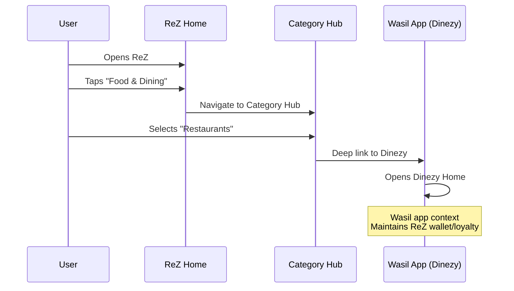
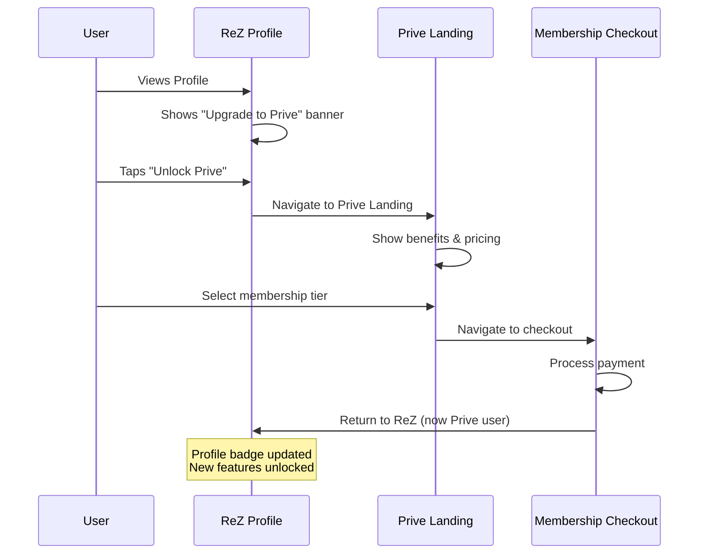
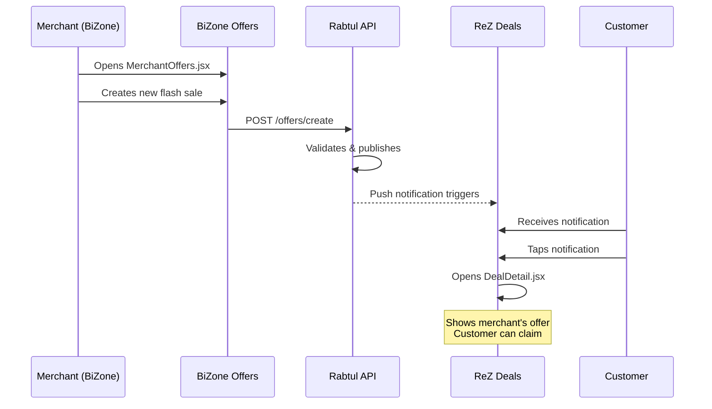
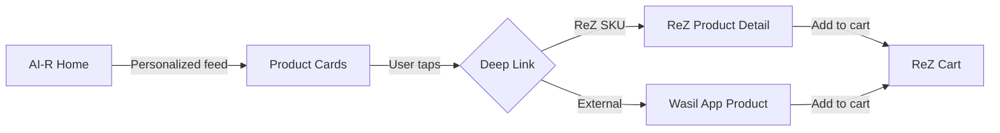
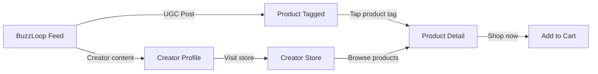
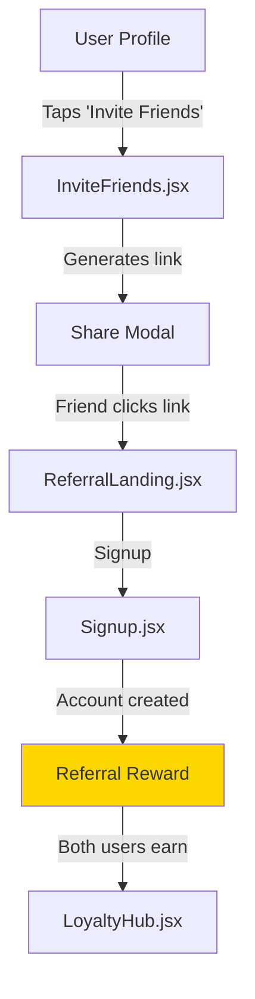
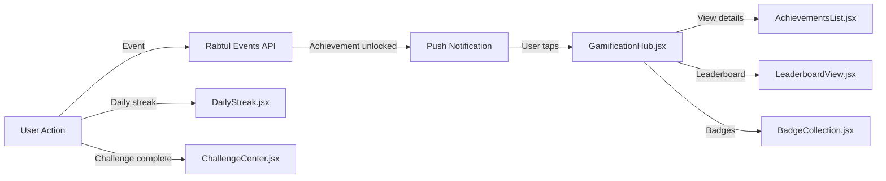

# RTMN Cross-App Navigation & Integration Map

**Total Apps:** 30+ (across 4 core pillars + distribution layers)
**Total Screens:** 1,103
**Last Updated:** 2026-01-03

This document maps all navigation flows between apps, deep linking strategies, and integration touchpoints across the entire RTMN ecosystem.

---

## Ecosystem Overview

```mermaid
graph TB
    subgraph "Core Platform - Phase 1"
        REZ[ReZ Customer App<br/>360 screens]
        BIZONE[BiZone Merchant OS<br/>222 screens]
        ADZY[Adzy Marketing<br/>TBD]
        RABTUL[Rabtul Infrastructure<br/>Backend]
    end

    subgraph "Premium Tier"
        PRIVE[ReZ Prive<br/>142 screens]
    end

    subgraph "HQ Administration"
        HQ[HQ Admin<br/>178 screens]
    end

    subgraph "Discovery Layer - Phase 2"
        AIR[AI-R Discovery<br/>15 screens]
        BUZZ[BuzzLoop Social<br/>8 screens]
        COIN[CoinHunt Deals<br/>5 screens]
        LOCAL[LocalEdge Local<br/>3 screens]
    end

    subgraph "Wasil Distribution - Phase 3"
        DINEZY[Dinezy F&B<br/>6 screens]
        GROCIFY[Grocify Grocery<br/>5 screens]
        GLOWZY[Glowzy Beauty<br/>4 screens]
        SHOPAZY[Shopazy Shopping<br/>5 screens]
        WASIL_MORE[+14 more Wasil apps<br/>60 screens]
    end

    subgraph "Growth Stack"
        REFERRAL[ReferralX<br/>5 screens]
        QUIZZY[Quizzy<br/>3 screens]
        GROWTH_MORE[+12 growth tools<br/>37 screens]
    end

    REZ -.->|Premium upgrade| PRIVE
    REZ -->|Discovery| AIR
    REZ -->|Social feed| BUZZ
    REZ -->|Deals engine| COIN
    REZ -->|Hyperlocal| LOCAL

    REZ -->|Vertical deep link| DINEZY
    REZ -->|Vertical deep link| GROCIFY
    REZ -->|Vertical deep link| GLOWZY
    REZ -->|Vertical deep link| SHOPAZY
    REZ -->|Vertical deep link| WASIL_MORE

    REZ <-->|Transactions| BIZONE
    BIZONE -->|Governed by| HQ
    REZ -->|Gamification| REFERRAL
    REZ -->|Earn loops| QUIZZY
    REZ -->|Growth hacks| GROWTH_MORE

    PRIVE -.->|Premium merchants| BIZONE
    RABTUL -.->|Powers all| REZ
    RABTUL -.->|Powers all| BIZONE
    RABTUL -.->|Powers all| PRIVE

    style REZ fill:#4CAF50,stroke:#2E7D32,color:#fff
    style BIZONE fill:#2196F3,stroke:#1565C0,color:#fff
    style PRIVE fill:#9C27B0,stroke:#6A1B9A,color:#fff
    style HQ fill:#F44336,stroke:#C62828,color:#fff
    style RABTUL fill:#607D8B,stroke:#37474F,color:#fff
```



---

## Deep Linking Architecture

### URL Scheme Structure

```
rezapp://[app]/[screen]/[params]

Examples:
rezapp://rez/product/12345
rezapp://rez/category/fashion
rezapp://bizone/merchant/dashboard
rezapp://prive/exclusive-offers
rezapp://wasil/dinezy/restaurant/789
```

### Universal Links (Web to App)

```
https://rez.app/[path] → Opens in app if installed

Examples:
https://rez.app/p/12345 → Product detail
https://rez.app/d/summer-sale → Deal detail
https://rez.app/m/starbucks → Merchant page
https://rez.app/refer/FRIEND123 → Referral flow
```

---

## Cross-App Navigation Patterns

### Pattern 1: ReZ → Wasil App (Vertical Redirect)

**User Journey:**


**Implementation:**
```javascript
// From ReZ Category Hub
onCategorySelect('restaurants') {
  if (shouldUseDinezy) {
    deepLink('rezapp://wasil/dinezy/home', {
      context: 'rez_category_browse',
      userId: currentUser.id,
      returnTo: 'rezapp://rez/home'
    })
  }
}
```

**Screens Involved:**
- **ReZ:** `CategoryHub.jsx` → `Categories.jsx`
- **Wasil:** `DinezyHome.jsx`

**Data Shared:**
- User authentication state
- Wallet balance
- Loyalty points
- Cart state (if applicable)

---

### Pattern 2: ReZ → ReZ Prive (Upgrade Flow)

**User Journey:**


**Screens Involved:**
- **ReZ:** `Profile.jsx`, `LoyaltyHub.jsx`
- **Prive:** `RezPrive.jsx`, `PriveMembershipCheckout.jsx`, `PriveBenefits.jsx`

**Trigger Points in ReZ:**
1. Profile → "Upgrade to Prive" CTA
2. Exclusive product → "Prive Members Only" → Upgrade prompt
3. Loyalty Hub → Tier visualization → Upgrade path
4. Checkout → "Unlock free delivery with Prive"

---

### Pattern 3: BiZone → ReZ (Merchant Create Offer → Customer View)

**User Journey:**


**Screens Involved:**
- **BiZone:** `MerchantOffers.jsx`, `CreateOffer.jsx`, `MerchantCampaigns.jsx`
- **ReZ:** `Deals.jsx`, `DealStore.jsx`, `DealDetail.jsx`, `OfferDetail.jsx`

**Integration Points:**
- Offer creation → Real-time sync
- Merchant analytics ← Customer engagement data
- Inventory sync (BiZone stock → ReZ availability)

---

### Pattern 4: Discovery Apps → ReZ Core

#### AI-R (AI Discovery) → ReZ Products



**Screens:**
- **AI-R:** `AIRHome.jsx`, `AIRRecommendations.jsx`, `AIRFeed.jsx`
- **ReZ:** `ProductDetail.jsx`, `Cart.jsx`

#### BuzzLoop (Social) → ReZ/Wasil



**Screens:**
- **BuzzLoop:** `BuzzLoopHome.jsx`, `BuzzLoopExplore.jsx`, `BuzzLoopProfile.jsx`
- **ReZ:** `CreatorStoreHome.jsx`, `CreatorProfile.jsx`, `ProductDetail.jsx`

---

## Integration Touchpoints Matrix

### Customer-Facing Integrations

| From Screen | To Screen | Trigger | Data Passed |
|------------|-----------|---------|-------------|
| `Home.jsx` (ReZ) | `DinezyHome.jsx` (Wasil) | "Food & Dining" tile | User ID, Location, Preferences |
| `DealDetail.jsx` (ReZ) | `ProductDetail.jsx` (ReZ) | "View Product" CTA | Product ID, Deal ID |
| `ProductDetail.jsx` | `Cart.jsx` | "Add to Cart" | Product, Qty, Variant |
| `Cart.jsx` | `Checkout.jsx` | "Proceed to Checkout" | Cart items, Subtotal |
| `Checkout.jsx` | `Wallet.jsx` | "Pay with Wallet" | Order total, Payment intent |
| `Wallet.jsx` | `PaymentGateway.jsx` | "Add Money" | Topup amount, Method |
| `Profile.jsx` | `RezPrive.jsx` (Prive) | "Upgrade" banner | User ID, Current tier |
| `LoyaltyHub.jsx` | `BrandLoyalty.jsx` | "View Brand Program" | Brand ID, User points |
| `SocialHub.jsx` | `BuzzLoopHome.jsx` (BuzzLoop) | "Trending Posts" | User preferences |
| `AIRFeed.jsx` (AI-R) | `ProductDetail.jsx` (ReZ) | AI recommendation | Product ID, Rec score |

---

### Merchant-Admin Integrations

| From Screen | To Screen | Trigger | Data Passed |
|------------|-----------|---------|-------------|
| `MerchantDashboard.jsx` | `HQCommandCenter.jsx` | Escalation button | Merchant ID, Issue |
| `HQCommandCenter.jsx` | `MerchantGovernance.jsx` | Merchant review | Merchant ID |
| `MerchantGovernance.jsx` | `MerchantDashboard.jsx` | Approval notification | Approval status |
| `MerchantOffers.jsx` | `DealStore.jsx` (ReZ) | Offer published | Offer ID, Metadata |
| `MerchantInventory.jsx` | `ProductListing.jsx` (ReZ) | Stock sync | Product ID, Stock level |
| `MerchantPOS.jsx` | `CustomerProfile.jsx` (ReZ) | Loyalty scan | Customer ID, Transaction |

---

## Growth Loop Integrations

### ReferralX Flow



**Screens:**
- `InviteFriends.jsx`
- `ReferralX/ReferralDashboard.jsx`
- `LoyaltyHub.jsx` (shows referral rewards)

---

### Gamification Integrations



**Trigger Actions:**
- First purchase → Badge unlock
- 5 orders in week → Challenge complete
- Refer 3 friends → Leaderboard points
- Daily login 7 days → Streak reward

---

## Deep Link Parameter Reference

### Product Deep Link
```
rezapp://rez/product/{productId}?
  source=buzzloop|air|coinhunt|organic
  &campaign={campaignId}
  &ref={userId}
```

**Supported Parameters:**
- `productId` (required): Product identifier
- `source`: Attribution source
- `campaign`: Marketing campaign ID
- `ref`: Referrer user ID
- `variant`: Pre-selected variant
- `qty`: Pre-filled quantity

**Landing Screen:** `ProductDetail.jsx`

---

### Category Deep Link
```
rezapp://rez/category/{categorySlug}?
  filter={filterJson}
  &sort={sortOption}
```

**Supported Parameters:**
- `categorySlug` (required): grocery, fashion, beauty, etc.
- `filter`: JSON-encoded filters
- `sort`: price_asc, price_desc, popular, newest

**Landing Screen:** `CategoryHub.jsx` or specific category screen

---

### Deal Deep Link
```
rezapp://rez/deal/{dealId}?
  utm_source={source}
  &utm_campaign={campaign}
```

**Landing Screen:** `DealDetail.jsx`

---

### Merchant Deep Link
```
rezapp://rez/merchant/{merchantId}?
  tab=products|offers|about
```

**Landing Screen:** `MerchantStorefront.jsx` (ReZ-side view)

---

### Wasil App Deep Link
```
rezapp://wasil/{appSlug}/{screen}?
  context=rez_home|rez_category|direct
```

**Examples:**
- `rezapp://wasil/dinezy/home`
- `rezapp://wasil/grocify/store/123`
- `rezapp://wasil/glowzy/service-booking`

**Landing Screens:** Varies by Wasil app

---

## Screen-to-Screen Navigation Table

### Top 50 Most Common Navigation Paths

| # | From | To | Action | Frequency |
|---|------|----|----|-----------|
| 1 | `Home.jsx` | `ProductDetail.jsx` | Tap product card | Very High |
| 2 | `ProductDetail.jsx` | `Cart.jsx` | Add to cart | Very High |
| 3 | `Cart.jsx` | `Checkout.jsx` | Checkout button | High |
| 4 | `Checkout.jsx` | `PaymentGateway.jsx` | Payment selection | High |
| 5 | `PaymentGateway.jsx` | `OrderSuccess.jsx` | Payment complete | High |
| 6 | `Home.jsx` | `CategoryHub.jsx` | Category tile | High |
| 7 | `CategoryHub.jsx` | `ProductListing.jsx` | Subcategory | High |
| 8 | `Home.jsx` | `SearchResults.jsx` | Search bar | High |
| 9 | `SearchResults.jsx` | `ProductDetail.jsx` | Result tap | High |
| 10 | `Home.jsx` | `DealStore.jsx` | Deals banner | Medium |
| 11 | `DealStore.jsx` | `DealDetail.jsx` | Deal card | Medium |
| 12 | `DealDetail.jsx` | `ProductDetail.jsx` | View product | Medium |
| 13 | `Home.jsx` | `Wallet.jsx` | Wallet widget | Medium |
| 14 | `Wallet.jsx` | `TransactionHistory.jsx` | View history | Medium |
| 15 | `Home.jsx` | `LoyaltyHub.jsx` | Coins widget | Medium |
| 16 | `LoyaltyHub.jsx` | `CoinHistory.jsx` | View transactions | Medium |
| 17 | `Profile.jsx` | `Orders.jsx` | My orders | High |
| 18 | `Orders.jsx` | `OrderDetail.jsx` | Order card | High |
| 19 | `OrderDetail.jsx` | `DeliveryTracking.jsx` | Track order | Medium |
| 20 | `Profile.jsx` | `AddressManagement.jsx` | Manage addresses | Medium |
| 21 | `Home.jsx` | `SocialHub.jsx` | Social tab | Medium |
| 22 | `SocialHub.jsx` | `CreatorProfile.jsx` | Creator card | Medium |
| 23 | `CreatorProfile.jsx` | `CreatorStoreHome.jsx` | Visit store | Medium |
| 24 | `Home.jsx` | `Explore.jsx` | Explore tab | High |
| 25 | `Explore.jsx` | `NewArrivals.jsx` | New section | Medium |
| 26 | `ProductDetail.jsx` | `SavedForLater.jsx` | Wishlist | Low |
| 27 | `Profile.jsx` | `EnhancedWishlist.jsx` | Wishlist menu | Low |
| 28 | `Home.jsx` | `QRScanner.jsx` | Scan & Pay | Medium |
| 29 | `QRScanner.jsx` | `MerchantBilling.jsx` | Code scanned | Medium |
| 30 | `MerchantDashboard.jsx` | `MerchantPOS.jsx` | POS button | Very High |
| 31 | `MerchantPOS.jsx` | `MerchantCheckout.jsx` | Process payment | Very High |
| 32 | `MerchantDashboard.jsx` | `MerchantInventory.jsx` | Inventory tile | High |
| 33 | `MerchantInventory.jsx` | `MerchantProductEdit.jsx` | Edit product | High |
| 34 | `MerchantDashboard.jsx` | `MerchantOrders.jsx` | Orders tile | High |
| 35 | `MerchantOrders.jsx` | `MerchantOrderDetail.jsx` | Order card | High |
| 36 | `MerchantDashboard.jsx` | `MerchantAnalytics.jsx` | Analytics tile | Medium |
| 37 | `MerchantDashboard.jsx` | `MerchantOffers.jsx` | Marketing tile | Medium |
| 38 | `MerchantOffers.jsx` | `CreateOffer.jsx` | Create button | Medium |
| 39 | `HQCommandCenter.jsx` | `MerchantGovernance.jsx` | Merchants tab | High |
| 40 | `MerchantGovernance.jsx` | `MerchantApprovalDetail.jsx` | Pending merchant | High |
| 41 | `HQCommandCenter.jsx` | `UserAccessGovernance.jsx` | Users tab | Medium |
| 42 | `Home.jsx` | `Events.jsx` | Events banner | Low |
| 43 | `Events.jsx` | `EventDetail.jsx` | Event card | Low |
| 44 | `EventDetail.jsx` | `EventTicketing.jsx` | Book ticket | Low |
| 45 | `Home.jsx` | `AIRHome.jsx` (Discovery) | AI recommendations | Medium |
| 46 | `AIRHome.jsx` | `ProductDetail.jsx` | AI product card | Medium |
| 47 | `Home.jsx` | `BuzzLoopHome.jsx` | Social feed | Low |
| 48 | `BuzzLoopHome.jsx` | `BuzzLoopExplore.jsx` | Explore tab | Low |
| 49 | `Profile.jsx` | `RezPrive.jsx` (Prive) | Upgrade banner | Low |
| 50 | `RezPrive.jsx` | `PriveMembershipCheckout.jsx` | Select tier | Low |

---

## State Management Across Apps

### Shared State (via Rabtul)

**User Session:**
- Authentication token
- User ID & profile
- Current location
- App preferences

**Wallet State:**
- Balance
- Payment methods
- Transaction history

**Loyalty State:**
- ReZ Coins balance
- Tier level
- Brand-specific points

**Cart State:**
- Line items
- Promo codes applied
- Delivery preferences

---

### App-Specific State

**ReZ Only:**
- Browsing history
- Wishlist
- Recent searches

**BiZone Only:**
- Active POS session
- Merchant settings
- Staff permissions

**Prive Only:**
- Membership tier
- Exclusive benefits unlocked
- Concierge requests

---

## Analytics & Tracking

### Cross-App Events

```javascript
// User moves from ReZ to Dinezy
trackEvent('cross_app_navigation', {
  from_app: 'rez',
  from_screen: 'CategoryHub',
  to_app: 'wasil_dinezy',
  to_screen: 'DinezyHome',
  context: 'category_browse_food',
  user_id: currentUser.id
})

// Product viewed from AI recommendation
trackEvent('product_view', {
  product_id: '12345',
  source: 'ai_recommendation',
  recommendation_id: 'rec_abc123',
  screen: 'ProductDetail'
})

// Deal claimed from BuzzLoop post
trackEvent('deal_claim', {
  deal_id: '789',
  source: 'buzzloop_ugc',
  post_id: 'post_xyz',
  creator_id: 'creator_123'
})
```

---

## Conclusion

This cross-app navigation map ensures:

1. ✅ **Seamless User Experience** - Users move fluidly between apps
2. ✅ **Proper Attribution** - Know where traffic comes from
3. ✅ **Shared State** - Wallet, loyalty, auth work everywhere
4. ✅ **Deep Linking** - Direct access to any screen
5. ✅ **Analytics** - Track full user journey
6. ✅ **Growth Loops** - Referrals and gamification work cross-app

---

**Next Actions:**
1. Implement deep linking infrastructure
2. Create shared state management layer
3. Build cross-app analytics dashboard
4. Design handoff animations between apps
5. Test all 50+ common navigation paths

---

**Status:** Architecture Complete - Ready for Implementation
