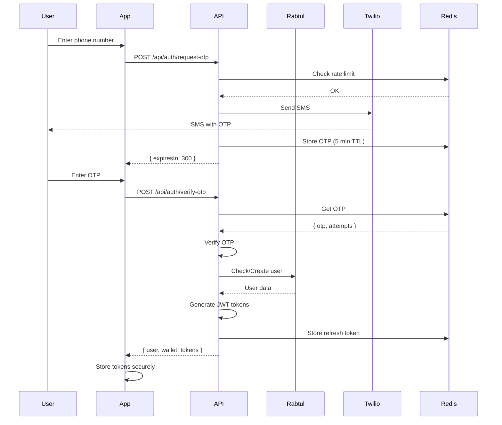
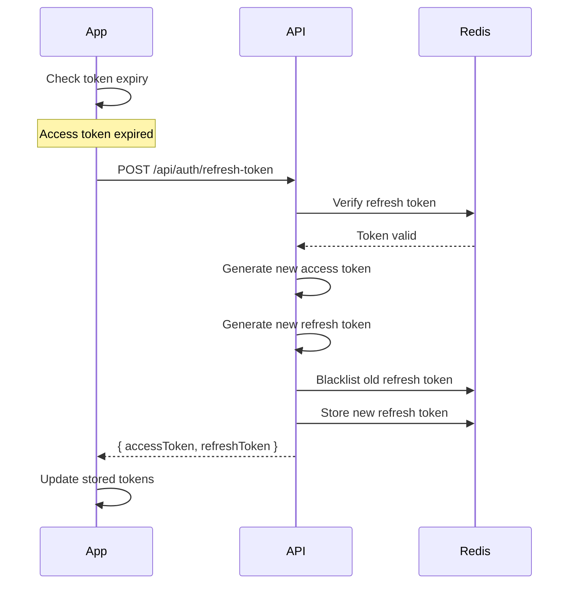
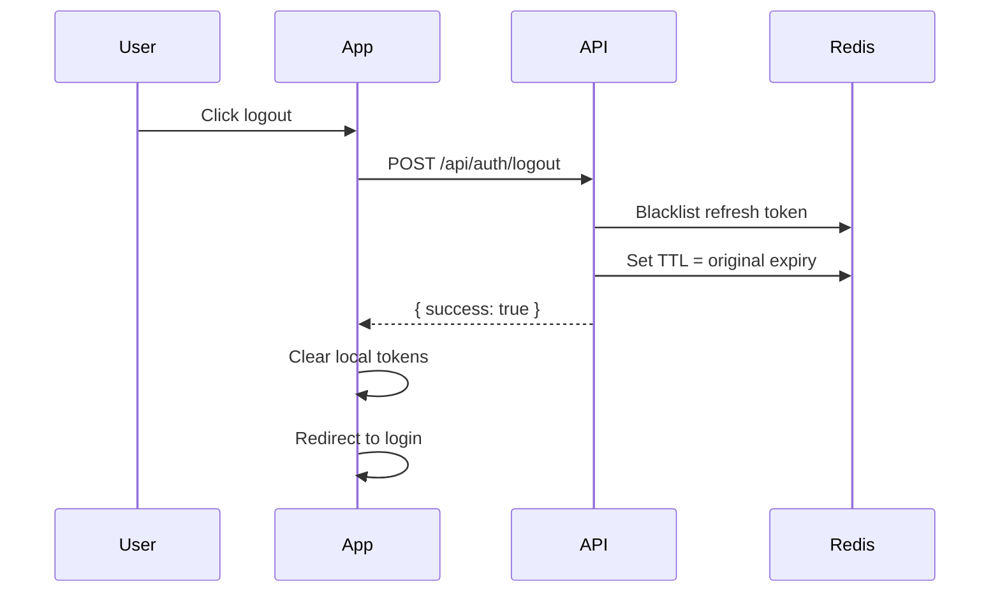

# Authentication Flow Details - RTMN Backend

**Last Updated:** 2026-01-03
**Status:** Production-Ready
**Authentication:** JWT-based with OTP verification

---

## 📋 OVERVIEW

Complete authentication flows for:
- OTP-based registration/login
- Token refresh mechanism
- Multi-device management
- Session handling
- Logout & token blacklisting

---

## 🔐 AUTHENTICATION FLOWS

### 1. OTP-Based Login/Registration Flow



---

### 2. Token Refresh Flow



---

### 3. Logout Flow



---

## 🔑 JWT TOKEN STRUCTURE

### Access Token Payload

```javascript
{
  "sub": "550e8400-e29b-41d4-a716-446655440000", // User ID
  "phone": "+919876543210",
  "email": "user@example.com",
  "role": "customer",
  "tier": "gold",
  "iat": 1704272400, // Issued at
  "exp": 1704273300, // Expires at (15 minutes)
  "iss": "rtmn-auth-service",
  "aud": "rtmn-apps",
  "type": "access"
}
```

### Refresh Token Payload

```javascript
{
  "sub": "550e8400-e29b-41d4-a716-446655440000",
  "iat": 1704272400,
  "exp": 1704877200, // Expires at (7 days)
  "iss": "rtmn-auth-service",
  "aud": "rtmn-apps",
  "type": "refresh",
  "jti": "token_unique_id_123" // For blacklisting
}
```

---

## 🔒 IMPLEMENTATION

### Generate Tokens

```javascript
const jwt = require('jsonwebtoken');
const { v4: uuidv4 } = require('uuid');

function generateTokens(user) {
  const accessTokenPayload = {
    sub: user.id,
    phone: user.phone,
    email: user.email,
    role: user.role,
    tier: user.tier,
    type: 'access'
  };

  const refreshTokenPayload = {
    sub: user.id,
    type: 'refresh',
    jti: uuidv4() // Unique token ID for blacklisting
  };

  const accessToken = jwt.sign(
    accessTokenPayload,
    process.env.JWT_SECRET,
    {
      expiresIn: process.env.JWT_ACCESS_TOKEN_EXPIRY, // '15m'
      issuer: process.env.JWT_ISSUER,
      audience: process.env.JWT_AUDIENCE
    }
  );

  const refreshToken = jwt.sign(
    refreshTokenPayload,
    process.env.JWT_SECRET,
    {
      expiresIn: process.env.JWT_REFRESH_TOKEN_EXPIRY, // '7d'
      issuer: process.env.JWT_ISSUER,
      audience: process.env.JWT_AUDIENCE
    }
  );

  return {
    accessToken,
    refreshToken,
    expiresIn: 900 // 15 minutes in seconds
  };
}
```

---

### Verify Access Token (Middleware)

```javascript
const jwt = require('jsonwebtoken');

async function authenticateToken(req, res, next) {
  const authHeader = req.headers['authorization'];
  const token = authHeader && authHeader.split(' ')[1]; // Bearer TOKEN

  if (!token) {
    return res.status(401).json({
      success: false,
      error: {
        code: 1001,
        message: 'Access token required'
      }
    });
  }

  try {
    const decoded = jwt.verify(token, process.env.JWT_SECRET, {
      issuer: process.env.JWT_ISSUER,
      audience: process.env.JWT_AUDIENCE
    });

    // Check token type
    if (decoded.type !== 'access') {
      throw new Error('Invalid token type');
    }

    // Attach user to request
    req.user = {
      id: decoded.sub,
      phone: decoded.phone,
      email: decoded.email,
      role: decoded.role,
      tier: decoded.tier
    };

    next();
  } catch (error) {
    if (error.name === 'TokenExpiredError') {
      return res.status(401).json({
        success: false,
        error: {
          code: 1004,
          message: 'Access token expired',
          retryable: true,
          action: 'REFRESH_TOKEN'
        }
      });
    }

    return res.status(403).json({
      success: false,
      error: {
        code: 1005,
        message: 'Invalid access token'
      }
    });
  }
}
```

---

### Refresh Token Endpoint

```javascript
const Redis = require('ioredis');
const redis = new Redis(process.env.REDIS_URL);

app.post('/api/auth/refresh-token', async (req, res) => {
  const { refreshToken } = req.body;

  if (!refreshToken) {
    return res.status(400).json({
      success: false,
      error: {
        code: 1006,
        message: 'Refresh token required'
      }
    });
  }

  try {
    // Verify refresh token
    const decoded = jwt.verify(refreshToken, process.env.JWT_SECRET);

    if (decoded.type !== 'refresh') {
      throw new Error('Invalid token type');
    }

    // Check if token is blacklisted
    const isBlacklisted = await redis.get(`blacklist:${decoded.jti}`);
    if (isBlacklisted) {
      return res.status(401).json({
        success: false,
        error: {
          code: 1007,
          message: 'Refresh token has been revoked',
          action: 'LOGIN_REQUIRED'
        }
      });
    }

    // Get user
    const user = await db.users.findByPk(decoded.sub);

    if (!user || !user.is_active) {
      return res.status(401).json({
        success: false,
        error: {
          code: 1008,
          message: 'User not found or inactive'
        }
      });
    }

    // Generate new tokens
    const tokens = generateTokens(user);

    // Blacklist old refresh token
    const ttl = decoded.exp - Math.floor(Date.now() / 1000);
    await redis.setex(`blacklist:${decoded.jti}`, ttl, '1');

    // Store new refresh token metadata
    await redis.setex(
      `refresh:${user.id}`,
      7 * 24 * 60 * 60, // 7 days
      JSON.stringify({
        jti: jwt.decode(tokens.refreshToken).jti,
        createdAt: new Date().toISOString()
      })
    );

    res.json({
      success: true,
      data: tokens
    });
  } catch (error) {
    if (error.name === 'TokenExpiredError') {
      return res.status(401).json({
        success: false,
        error: {
          code: 1009,
          message: 'Refresh token expired',
          action: 'LOGIN_REQUIRED'
        }
      });
    }

    res.status(403).json({
      success: false,
      error: {
        code: 1010,
        message: 'Invalid refresh token'
      }
    });
  }
});
```

---

### Logout Endpoint

```javascript
app.post('/api/auth/logout', authenticateToken, async (req, res) => {
  const { refreshToken } = req.body;

  if (!refreshToken) {
    return res.status(400).json({
      success: false,
      error: {
        code: 1011,
        message: 'Refresh token required for logout'
      }
    });
  }

  try {
    const decoded = jwt.verify(refreshToken, process.env.JWT_SECRET);

    // Blacklist refresh token
    const ttl = decoded.exp - Math.floor(Date.now() / 1000);
    await redis.setex(`blacklist:${decoded.jti}`, ttl, '1');

    // Remove from active sessions
    await redis.del(`refresh:${req.user.id}`);

    res.json({
      success: true,
      message: 'Logged out successfully'
    });
  } catch (error) {
    // Even if token verification fails, consider logout successful
    res.json({
      success: true,
      message: 'Logged out successfully'
    });
  }
});
```

---

## 📱 MULTI-DEVICE MANAGEMENT

### Store Device Tokens

```javascript
app.post('/api/auth/register-device', authenticateToken, async (req, res) => {
  const { deviceId, platform, fcmToken } = req.body;

  await db.device_tokens.upsert({
    user_id: req.user.id,
    device_id: deviceId,
    platform: platform, // 'android', 'ios', 'web'
    fcm_token: fcmToken,
    is_active: true,
    last_used_at: new Date()
  });

  res.json({
    success: true,
    message: 'Device registered successfully'
  });
});
```

### Get Active Sessions

```javascript
app.get('/api/auth/sessions', authenticateToken, async (req, res) => {
  const sessions = await db.device_tokens.findAll({
    where: {
      user_id: req.user.id,
      is_active: true
    },
    attributes: ['device_id', 'platform', 'last_used_at', 'created_at']
  });

  res.json({
    success: true,
    data: { sessions }
  });
});
```

### Logout from Specific Device

```javascript
app.post('/api/auth/logout-device', authenticateToken, async (req, res) => {
  const { deviceId } = req.body;

  await db.device_tokens.update(
    { is_active: false },
    {
      where: {
        user_id: req.user.id,
        device_id: deviceId
      }
    }
  );

  res.json({
    success: true,
    message: 'Device logged out successfully'
  });
});
```

---

## 🔐 SECURITY BEST PRACTICES

### 1. Token Storage (Frontend)

```javascript
// ❌ WRONG - LocalStorage (vulnerable to XSS)
localStorage.setItem('accessToken', token);

// ✅ CORRECT - Secure storage (React Native)
import * as SecureStore from 'expo-secure-store';

await SecureStore.setItemAsync('accessToken', token);
```

### 2. Automatic Token Refresh

```javascript
// Axios interceptor for auto-refresh
axios.interceptors.response.use(
  response => response,
  async error => {
    const originalRequest = error.config;

    if (error.response?.status === 401 && error.response?.data?.error?.code === 1004) {
      // Access token expired
      try {
        const refreshToken = await SecureStore.getItemAsync('refreshToken');
        const response = await axios.post('/api/auth/refresh-token', { refreshToken });

        const { accessToken, refreshToken: newRefreshToken } = response.data.data;

        await SecureStore.setItemAsync('accessToken', accessToken);
        await SecureStore.setItemAsync('refreshToken', newRefreshToken);

        originalRequest.headers['Authorization'] = `Bearer ${accessToken}`;
        return axios(originalRequest);
      } catch (refreshError) {
        // Refresh failed - logout
        navigation.navigate('Login');
        return Promise.reject(refreshError);
      }
    }

    return Promise.reject(error);
  }
);
```

### 3. Rate Limiting (Login Attempts)

```javascript
const rateLimit = require('express-rate-limit');

const loginLimiter = rateLimit({
  windowMs: 15 * 60 * 1000, // 15 minutes
  max: 5, // Max 5 attempts
  message: {
    success: false,
    error: {
      code: 1012,
      message: 'Too many login attempts. Please try again in 15 minutes.'
    }
  },
  standardHeaders: true,
  legacyHeaders: false
});

app.post('/api/auth/verify-otp', loginLimiter, verifyOTPHandler);
```

---

## 📊 OTP CONFIGURATION

### OTP Settings

```javascript
const OTP_CONFIG = {
  length: 6,                    // 6-digit OTP
  expiryMinutes: 5,             // 5 minutes validity
  maxAttempts: 3,               // Max 3 verification attempts
  resendCooldownSeconds: 30,    // Wait 30 seconds before resend
  dailyLimitPerPhone: 10        // Max 10 OTPs per phone per day
};
```

### Generate OTP

```javascript
function generateOTP() {
  return Math.floor(100000 + Math.random() * 900000).toString();
}
```

### Store OTP in Redis

```javascript
async function storeOTP(phone, otp) {
  const key = `otp:${phone}`;
  const data = {
    otp,
    attempts: 0,
    createdAt: new Date().toISOString()
  };

  await redis.setex(
    key,
    OTP_CONFIG.expiryMinutes * 60,
    JSON.stringify(data)
  );
}
```

---

**Status:** ✅ Production-Ready
**Last Updated:** 2026-01-03
**Security:** JWT + Redis blacklisting
**Next:** [Real-Time Implementation Guide](./REALTIME_IMPLEMENTATION_GUIDE.md)
