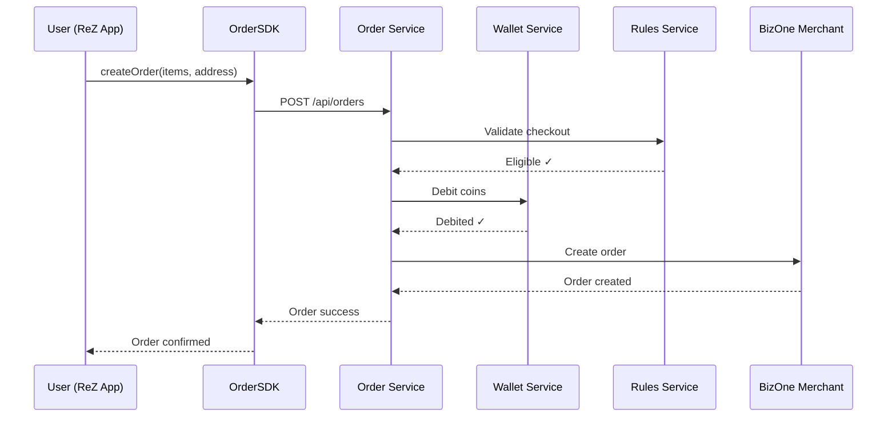

# REFERENCE: ReZ to BizOne Order Flow

**Gold standard implementation for cross-company order flow.**

---

## 🎯 USE CASE

User on **ReZ app** orders product from **BizOne merchant**.

This is the most common flow in RTMN ecosystem.

---

## 📋 WHAT THIS COVERS

✅ User browses merchant (BizOne) via ReZ app
✅ Adds items to cart
✅ Applies campaign discount
✅ Pays with wallet (mixed coins)
✅ Order created in BizOne
✅ Coins debited from wallet
✅ Merchant fulfills order
✅ Order completed
✅ Cashback credited

**Plus all error scenarios and edge cases.**

---

## 🏗️ SYSTEMS INVOLVED

```
1. ReZ App (Frontend)
   → Uses: OrderSDK, WalletSDK, CampaignSDK

2. Rabtul Order Service (Backend)
   → Orchestrates order creation

3. Rabtul Wallet Service (Backend)
   → Handles coin debits/credits

4. Rabtul Rules Service (Backend)
   → Validates campaigns, eligibility

5. BizOne Merchant System
   → Receives order, fulfills

6. Rabtul Events (Event Bus)
   → Emits state changes
```

---

## 📊 HIGH-LEVEL FLOW



---

## 📁 DETAILED DOCUMENTATION

| File | What It Contains |
|------|------------------|
| [sequence.md](./sequence.md) | Step-by-step sequence diagram with ALL steps |
| [api-calls.md](./api-calls.md) | Exact API requests/responses with real payloads |
| [events.md](./events.md) | Events emitted at each step |
| [state-transitions.md](./state-transitions.md) | Order + Wallet state changes |
| [error-handling.md](./error-handling.md) | All error scenarios |
| [edge-cases.md](./edge-cases.md) | Rare but important cases |

---

## ⏱️ TIMELINE

From cart to order confirmed:

- **Happy path**: 2-3 seconds
- **With campaign validation**: 3-4 seconds
- **Error + retry**: 5-6 seconds

---

## 💰 MONEY FLOW

Example order: ₹500

```
User wallet before:
├── Promo coins: 200
├── Branded coins: 150
├── ReZ coins: 100
└── Cash: 100

Order amount: 500

Debit breakdown (priority order):
├── Promo coins: 200 (used first)
├── Branded coins: 150 (used second)
├── ReZ coins: 100 (used third)
├── Cash: 50 (used last)
└── Total: 500 ✓

User wallet after:
├── Promo coins: 0
├── Branded coins: 0
├── ReZ coins: 0
└── Cash: 50
```

**Wallet transaction is ATOMIC with order creation.**

---

## 🎯 KEY DECISIONS IN THIS FLOW

### 1. Order + Wallet Debit = ONE Transaction
**Why:** If order fails, coins must not be debited.
**How:** Database transaction wraps both operations.

### 2. Campaign Validation BEFORE Wallet Debit
**Why:** Don't debit if user not eligible.
**How:** Rules service validates first.

### 3. Coin Priority is MANDATORY
**Why:** Promo coins expire first, must be used.
**How:** Wallet service enforces priority automatically.

### 4. Events Emitted AFTER Success
**Why:** Don't emit if transaction rolls back.
**How:** Events sent after commit.

---

## 🧪 HOW TO TEST THIS FLOW

```bash
# 1. Create test user with coins
POST /api/test/create-user-with-balance
{
  "promo_coins": 200,
  "rez_coins": 100,
  "cash": 200
}

# 2. Create order via SDK
const order = await orderSDK.createOrder({
  user_id: testUser.id,
  merchant_id: bizOneMerchant.id,
  items: [{ product_id: 'prod_123', quantity: 2, unit_price: 250 }],
  delivery_address: { ... },
  payment_method: 'wallet'
}, accessToken);

# 3. Verify wallet debited correctly
const balance = await walletSDK.getBalance(testUser.id, accessToken);
expect(balance.promo_coins).toBe(0); // Used first
expect(balance.rez_coins).toBe(0);   // Used second
expect(balance.cash).toBe(0);        // Used last

# 4. Verify order created in BizOne
// (Check BizOne dashboard or API)
```

---

## 📖 LEARN BY READING IN ORDER

**Recommended sequence:**

1. **This file** (overview) ✓ You are here
2. [sequence.md](./sequence.md) - See complete flow
3. [api-calls.md](./api-calls.md) - See exact API calls
4. [error-handling.md](./error-handling.md) - See error scenarios
5. [edge-cases.md](./edge-cases.md) - See rare cases

**Time: 1 hour**
**Result:** Complete understanding of order flow

---

## 🔗 RELATED FLOWS

- [wallet-topup/](../wallet-topup/) - How users add money
- [campaign-cashback/](../campaign-cashback/) - How cashback is credited
- [order-refund/](../order-refund/) - How refunds work

---

**Generated**: 2026-01-04
**Status**: PRODUCTION-READY
**Last Updated**: 2026-01-04
**Maintainer**: @architecture-team
