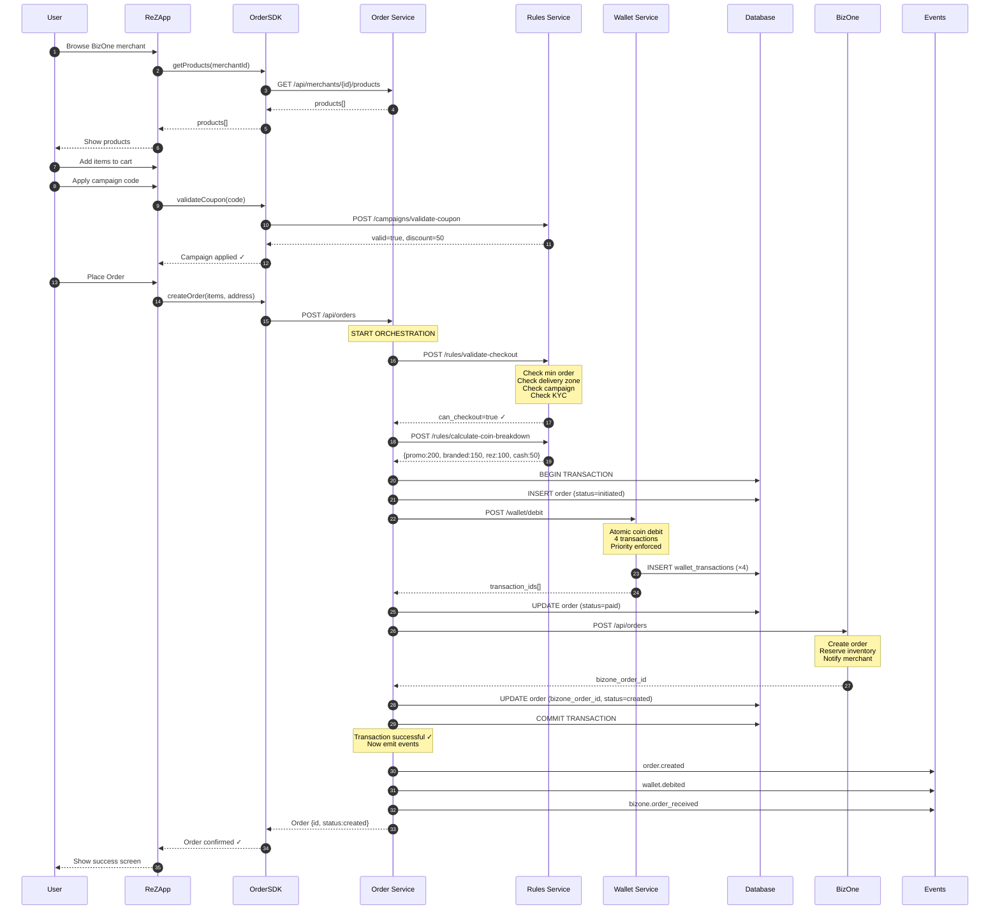

# SEQUENCE DIAGRAM: ReZ to BizOne Order Flow

**Complete step-by-step flow with all systems.**

---

## 🎬 COMPLETE SEQUENCE

```
USER (ReZ App)
  ↓
  1. Browse merchant (GET /api/merchants/{id})
  ↓
  2. View products (GET /api/merchants/{id}/products)
  ↓
  3. Add to cart (local state)
  ↓
  4. Apply campaign (POST /api/campaigns/validate-coupon)
  ↓
  5. Click "Place Order"
     ↓
     OrderSDK.createOrder()
       ↓
       6. POST /api/orders (Order Service)
          ↓
          7. Validate checkout (POST /rules/validate-checkout)
             ↓ Rules Service checks:
             - Min order value ✓
             - Delivery zone ✓
             - Campaign eligibility ✓
             - User KYC ✓
             ← Returns: can_checkout=true
          ↓
          8. Calculate coin breakdown (POST /rules/calculate-coin-breakdown)
             ← Returns: { promo: 200, branded: 150, rez: 100, cash: 50 }
          ↓
          9. BEGIN DATABASE TRANSACTION
             ↓
             10. Create order record (status=initiated)
             ↓
             11. Debit wallet (POST /wallet/debit)
                 ↓ Wallet Service:
                 - Validates balance ✓
                 - Creates 4 wallet_transactions (ATOMIC)
                 - Updates computed balance view
                 ← Returns: transaction_ids[]
             ↓
             12. Update order (status=paid)
             ↓
             13. Send to BizOne (POST /bizone/api/orders)
                 ← BizOne returns: order_id
             ↓
             14. Update order (bizone_order_id, status=created)
             ↓
             15. COMMIT TRANSACTION
          ↓
          16. Emit events (AFTER commit)
              - order.created
              - wallet.debited
              - bizone.order_received
          ↓
          17. Return order to SDK
             ← { order_id, status: 'created', ... }
     ↓
     18. SDK returns to frontend
  ↓
  19. Show "Order Confirmed" screen
  ↓
  20. Navigate to order tracking
```

---

## 📊 VISUAL SEQUENCE



---

## ⏱️ STEP-BY-STEP TIMING

| Step | Action | Time | Cumulative |
|------|--------|------|------------|
| 1-5 | Browse & cart | 0ms | 0ms |
| 6 | SDK call | 10ms | 10ms |
| 7 | Rules validate | 150ms | 160ms |
| 8 | Coin breakdown | 50ms | 210ms |
| 9-10 | DB transaction start | 5ms | 215ms |
| 11 | Wallet debit | 100ms | 315ms |
| 12 | Update order | 20ms | 335ms |
| 13 | BizOne API | 500ms | 835ms |
| 14 | Update order | 20ms | 855ms |
| 15 | Commit | 10ms | 865ms |
| 16 | Emit events | 50ms | 915ms |
| 17-19 | SDK + UI | 85ms | 1000ms |

**Total: ~1 second** (happy path)

---

## 🔄 STATE TRANSITIONS

### Order State:
```
NULL → initiated → paid → created
```

### Wallet State (4 transactions created):
```
Transaction 1: credit_promo_coins → debit_order_payment (-200)
Transaction 2: credit_branded_coins → debit_order_payment (-150)
Transaction 3: credit_rez_coins → debit_order_payment (-100)
Transaction 4: credit_cash → debit_order_payment (-50)
```

All 4 transactions have:
- `status: 'completed'`
- `related_order_id: {order_id}`
- `created_at: {same_timestamp}` (atomic)

---

## 🎯 CRITICAL POINTS

### Point A: Validation Before Debit
```
Rules validation MUST complete before wallet debit.
If validation fails → no money movement.
```

### Point B: Atomic Transaction
```
Order creation + Wallet debit = ONE database transaction.
If ANY step fails → BOTH rollback.
```

### Point C: BizOne Inside Transaction
```
BizOne API call happens INSIDE transaction.
If BizOne fails → entire transaction rolls back.
Alternative: Use saga pattern (not implemented yet).
```

### Point D: Events After Commit
```
Events emitted ONLY after successful commit.
Prevents events for failed orders.
```

---

## 📋 NEXT: See API Calls

[Go to api-calls.md](./api-calls.md) for exact request/response payloads.
