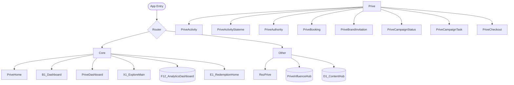
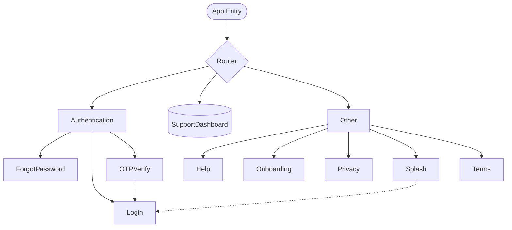

# RTMN Detailed Screen Navigation & UX Flows

**Total Screens:** 1103
**Analysis Date:** 2026-01-03

This document provides detailed screen-by-screen navigation flows for the entire RTMN ecosystem.

## Overview

| App Category | Screen Count | Main Screens | Categories |
|--------------|--------------|--------------|------------|
| BizOne (Merchant OS) | 222 | 10 | 2 |
| Category-Specific | 182 | 21 | 21 |
| Discovery Layer | 31 | 4 | 5 |
| Growth Stack | 45 | 14 | 1 |
| HQ Admin | 178 | 14 | 1 |
| ReZ (Customer App) | 213 | 129 | 4 |
| ReZ Prive (Premium) | 142 | 9 | 1 |
| Shared/Common | 10 | 9 | 1 |
| Wasil Distribution Apps | 80 | 23 | 1 |

---

## BizOne (Merchant OS)

**Total Screens:** 222

### BizOne (Merchant OS) - Detailed Navigation Flow

```mermaid
graph TB
    %% BizOne (Merchant OS)
    %% Total: 222 screens

    START([App Entry]) --> ROUTER{Router}

    %% CORE AREA
    ROUTER --> AREA_CORE[Core]

    N1["MerchantDashboard"]
    AREA_CORE --> N1
    N2[("MerchantExpiryDashboard")]
    AREA_CORE --> N2
    N3["MerchantMultiStoreDashboard"]
    AREA_CORE --> N3
    N4["MerchantSuperOSDashboard"]
    AREA_CORE --> N4
    N5["PartnerDashboard"]
    AREA_CORE --> N5

    %% OTHER AREA
    ROUTER --> AREA_OTHER[Other]

    N6{{"MerchantAdzyHub"}}
    AREA_OTHER --> N6
    N7[("MerchantCreatorHub")]
    AREA_OTHER --> N7
    N8{{"MerchantHardwareHub"}}
    AREA_OTHER --> N8
    N9[("MerchantIntegrationHub")]
    AREA_OTHER --> N9
    N10{{"MerchantSupportHub"}}
    AREA_OTHER --> N10

    %% MERCHANT SUB-SCREENS
    CAT_MERCHANT["Merchant"]
    N11["CreateOffer"]
    CAT_MERCHANT --> N11
    N12["MerchantAccountantPo"]
    CAT_MERCHANT --> N12
    N13["MerchantAccounting"]
    CAT_MERCHANT --> N13
    N14["MerchantAggregatorBr"]
    CAT_MERCHANT --> N14
    N15["MerchantAggregatorRe"]
    CAT_MERCHANT --> N15
    N16["MerchantAnalytics"]
    CAT_MERCHANT --> N16
    N17["MerchantAppointments"]
    CAT_MERCHANT --> N17
    N18["MerchantAutoRestock"]
    CAT_MERCHANT --> N18

    %% Styling
    classDef coreClass fill:#4CAF50,stroke:#2E7D32,color:#fff
    classDef commerceClass fill:#2196F3,stroke:#1565C0,color:#fff
    classDef authClass fill:#FF9800,stroke:#E65100,color:#fff
    classDef accountClass fill:#9C27B0,stroke:#6A1B9A,color:#fff
```

### Feature-Based Screen Catalog

#### Analytics & Reporting (10 screens)

View all 10 screens

| # | Screen Name | Type | Path |
|---|-------------|------|------|
| 1 | MerchantAnalytics | Standard | `merchant/MerchantAnalytics.jsx` |
| 2 | MerchantDashboard | Standard | `merchant/MerchantDashboard.jsx` |
| 3 | MerchantDayEndReport | Drawer | `merchant/MerchantDayEndReport.jsx` |
| 4 | MerchantDealAnalytics | Standard | `merchant/MerchantDealAnalytics.jsx` |
| 5 | MerchantExpiryDashboard | Tab View | `merchant/MerchantExpiryDashboard.jsx` |
| 6 | MerchantGSTReports | Tab View | `merchant/MerchantGSTReports.jsx` |
| 7 | MerchantMultiStoreDashboard | Standard | `merchant/MerchantMultiStoreDashboard.jsx` |
| 8 | MerchantSuperOSDashboard | Standard | `merchant/MerchantSuperOSDashboard.jsx` |
| 9 | MerchantTDSTCSReports | Tab View | `merchant/MerchantTDSTCSReports.jsx` |
| 10 | PartnerDashboard | Standard | `partner/PartnerDashboard.jsx` |

#### Billing & Payments (17 screens)

View all 17 screens

| # | Screen Name | Type | Path |
|---|-------------|------|------|
| 1 | MerchantCategoryPOS | Modal | `merchant/MerchantCategoryPOS.jsx` |
| 2 | MerchantEInvoice | Modal | `merchant/MerchantEInvoice.jsx` |
| 3 | MerchantFailedPayments | Tab View | `merchant/MerchantFailedPayments.jsx` |
| 4 | MerchantInvoiceScanner | Standard | `merchant/MerchantInvoiceScanner.jsx` |
| 5 | MerchantOfflinePOS | Tab View | `merchant/MerchantOfflinePOS.jsx` |
| 6 | MerchantOfflinePOSSync | Standard | `merchant/MerchantOfflinePOSSync.jsx` |
| 7 | MerchantPOS | Modal | `merchant/MerchantPOS.jsx` |
| 8 | MerchantPOSIntegration | Tab View | `merchant/MerchantPOSIntegration.jsx` |
| 9 | MerchantPOSTransactions | Tab View | `merchant/MerchantPOSTransactions.jsx` |
| 10 | MerchantPaymentIntents | Modal | `merchant/MerchantPaymentIntents.jsx` |
| 11 | MerchantPaymentLinks | Modal | `merchant/MerchantPaymentLinks.jsx` |
| 12 | MerchantPaymentReminders | Modal | `merchant/MerchantPaymentReminders.jsx` |
| 13 | MerchantPayments | Modal | `merchant/MerchantPayments.jsx` |
| 14 | MerchantPostPaymentRewards | Tab View | `merchant/MerchantPostPaymentRewards.jsx` |
| 15 | MerchantQRPayments | Modal | `merchant/MerchantQRPayments.jsx` |
| 16 | MerchantSimplePOS | Modal | `merchant/MerchantSimplePOS.jsx` |
| 17 | MerchantSoftPOS | Standard | `merchant/MerchantSoftPOS.jsx` |

#### Customer Management (6 screens)

View all 6 screens

| # | Screen Name | Type | Path |
|---|-------------|------|------|
| 1 | MerchantCRM | Tab View | `merchant/MerchantCRM.jsx` |
| 2 | MerchantCustomerIdentity | Modal | `merchant/MerchantCustomerIdentity.jsx` |
| 3 | MerchantCustomerSegmentation | Tab View | `merchant/MerchantCustomerSegmentation.jsx` |
| 4 | MerchantCustomers | Standard | `merchant/MerchantCustomers.jsx` |
| 5 | MerchantMemberships | Tab View | `merchant/MerchantMemberships.jsx` |
| 6 | MerchantUserRoles | Tab View | `merchant/MerchantUserRoles.jsx` |

#### Integrations (6 screens)

View all 6 screens

| # | Screen Name | Type | Path |
|---|-------------|------|------|
| 1 | MerchantAggregatorBridge | Tab View | `merchant/MerchantAggregatorBridge.jsx` |
| 2 | MerchantCalendarSync | Tab View | `merchant/MerchantCalendarSync.jsx` |
| 3 | MerchantERPConnector | Tab View | `merchant/MerchantERPConnector.jsx` |
| 4 | MerchantIntegrationHealth | Tab View | `merchant/MerchantIntegrationHealth.jsx` |
| 5 | MerchantIntegrationHub | Tab View | `merchant/MerchantIntegrationHub.jsx` |
| 6 | MerchantIntegrations | Tab View | `merchant/MerchantIntegrations.jsx` |

#### Inventory Management (15 screens)

View all 15 screens

| # | Screen Name | Type | Path |
|---|-------------|------|------|
| 1 | MerchantAutoRestock | Modal | `merchant/MerchantAutoRestock.jsx` |
| 2 | MerchantComboProducts | Modal | `merchant/MerchantComboProducts.jsx` |
| 3 | MerchantInventory | Modal | `merchant/MerchantInventory.jsx` |
| 4 | MerchantInventoryAdvanced | Tab View | `merchant/MerchantInventoryAdvanced.jsx` |
| 5 | MerchantInventoryForecasting | Standard | `merchant/MerchantInventoryForecasting.jsx` |
| 6 | MerchantInventoryTransfer | Standard | `merchant/MerchantInventoryTransfer.jsx` |
| 7 | MerchantLowStockAlerts | Modal | `merchant/MerchantLowStockAlerts.jsx` |
| 8 | MerchantProductBundles | Standard | `merchant/MerchantProductBundles.jsx` |
| 9 | MerchantProductBundling | Standard | `merchant/MerchantProductBundling.jsx` |
| 10 | MerchantProductVariants | Modal | `merchant/MerchantProductVariants.jsx` |
| 11 | MerchantProducts | Modal | `merchant/MerchantProducts.jsx` |
| 12 | MerchantServiceCatalog | Modal | `merchant/MerchantServiceCatalog.jsx` |
| 13 | MerchantStockReconciliation | Modal | `merchant/MerchantStockReconciliation.jsx` |
| 14 | MerchantStockTransfer | Modal | `merchant/MerchantStockTransfer.jsx` |
| 15 | MerchantStockVarianceReport | Modal | `merchant/MerchantStockVarianceReport.jsx` |

#### Loyalty & Rewards (8 screens)

View all 8 screens

| # | Screen Name | Type | Path |
|---|-------------|------|------|
| 1 | MerchantBirthdayRewards | Modal | `merchant/MerchantBirthdayRewards.jsx` |
| 2 | MerchantCashbackPrograms | Modal | `merchant/MerchantCashbackPrograms.jsx` |
| 3 | MerchantGamificationRewards | Modal | `merchant/MerchantGamificationRewards.jsx` |
| 4 | MerchantLoyalty | Tab View | `merchant/MerchantLoyalty.jsx` |
| 5 | MerchantLoyaltyBuilder | Modal | `merchant/MerchantLoyaltyBuilder.jsx` |
| 6 | MerchantLoyaltyOffers | Modal | `merchant/MerchantLoyaltyOffers.jsx` |
| 7 | MerchantLoyaltyTiers | Standard | `merchant/MerchantLoyaltyTiers.jsx` |
| 8 | MerchantPointsRules | Standard | `merchant/MerchantPointsRules.jsx` |

#### Marketing & Offers (15 screens)

View all 15 screens

| # | Screen Name | Type | Path |
|---|-------------|------|------|
| 1 | CreateOffer | Standard | `merchant/CreateOffer.jsx` |
| 2 | MerchantBOGOOffers | Modal | `merchant/MerchantBOGOOffers.jsx` |
| 3 | MerchantBirthdayOffers | Modal | `merchant/MerchantBirthdayOffers.jsx` |
| 4 | MerchantCampaigns | Modal | `merchant/MerchantCampaigns.jsx` |
| 5 | MerchantExclusiveDeals | Modal | `merchant/MerchantExclusiveDeals.jsx` |
| 6 | MerchantFlashDeals | Modal | `merchant/MerchantFlashDeals.jsx` |
| 7 | MerchantLockPriceDeals | Standard | `merchant/MerchantLockPriceDeals.jsx` |
| 8 | MerchantMarketing | Standard | `merchant/MerchantMarketing.jsx` |
| 9 | MerchantMarketingCampaigns | Tab View | `merchant/MerchantMarketingCampaigns.jsx` |
| 10 | MerchantNearbyOffers | Modal | `merchant/MerchantNearbyOffers.jsx` |
| 11 | MerchantOffers | Standard | `merchant/MerchantOffers.jsx` |
| 12 | MerchantOfflineMarketing | Modal | `merchant/MerchantOfflineMarketing.jsx` |
| 13 | MerchantTodaysOffers | Modal | `merchant/MerchantTodaysOffers.jsx` |
| 14 | MerchantUGCCampaigns | Modal | `merchant/MerchantUGCCampaigns.jsx` |
| 15 | MerchantUnifiedMarketing | Modal | `merchant/MerchantUnifiedMarketing.jsx` |

#### Order Management (9 screens)

View all 9 screens

| # | Screen Name | Type | Path |
|---|-------------|------|------|
| 1 | MerchantBulkOrdering | Modal | `merchant/MerchantBulkOrdering.jsx` |
| 2 | MerchantDeliveryBridge | Tab View | `merchant/MerchantDeliveryBridge.jsx` |
| 3 | MerchantDeliveryFleet | Standard | `merchant/MerchantDeliveryFleet.jsx` |
| 4 | MerchantFreeDelivery | Standard | `merchant/MerchantFreeDelivery.jsx` |
| 5 | MerchantOrders | Modal | `merchant/MerchantOrders.jsx` |
| 6 | MerchantOrdersMultiChannel | Tab View | `merchant/MerchantOrdersMultiChannel.jsx` |
| 7 | MerchantPurchaseOrders | Modal | `merchant/MerchantPurchaseOrders.jsx` |
| 8 | MerchantQROrdering | Tab View | `merchant/MerchantQROrdering.jsx` |
| 9 | MerchantUnifiedOrders | Modal | `merchant/MerchantUnifiedOrders.jsx` |

#### Other (133 screens)

View all 133 screens

| # | Screen Name | Type | Path |
|---|-------------|------|------|
| 1 | MerchantAccountantPortal | Tab View | `merchant/MerchantAccountantPortal.jsx` |
| 2 | MerchantAccounting | Standard | `merchant/MerchantAccounting.jsx` |
| 3 | MerchantAdzyHub | Modal | `merchant/MerchantAdzyHub.jsx` |
| 4 | MerchantAggregatorReconciliation | Tab View | `merchant/MerchantAggregatorReconciliation.jsx` |
| 5 | MerchantAppointments | Modal | `merchant/MerchantAppointments.jsx` |
| 6 | MerchantAutopilot | Standard | `merchant/MerchantAutopilot.jsx` |
| 7 | MerchantBarcodeGenerator | Standard | `merchant/MerchantBarcodeGenerator.jsx` |
| 8 | MerchantBarcodeScanner | Standard | `merchant/MerchantBarcodeScanner.jsx` |
| 9 | MerchantBatchTracking | Tab View | `merchant/MerchantBatchTracking.jsx` |
| 10 | MerchantBenchmarks | Standard | `merchant/MerchantBenchmarks.jsx` |
| 11 | MerchantBillHold | Modal | `merchant/MerchantBillHold.jsx` |
| 12 | MerchantBillManagement | Modal | `merchant/MerchantBillManagement.jsx` |
| 13 | MerchantBillSplitting | Tab View | `merchant/MerchantBillSplitting.jsx` |
| 14 | MerchantBookingCalendar | Tab View | `merchant/MerchantBookingCalendar.jsx` |
| 15 | MerchantBranchManager | Standard | `merchant/MerchantBranchManager.jsx` |
| 16 | MerchantBulkImport | Tab View | `merchant/MerchantBulkImport.jsx` |
| 17 | MerchantBusinessDetails | Standard | `merchant/MerchantBusinessDetails.jsx` |
| 18 | MerchantCaptainApp | Tab View | `merchant/MerchantCaptainApp.jsx` |
| 19 | MerchantCartAbandonment | Standard | `merchant/MerchantCartAbandonment.jsx` |
| 20 | MerchantCashDrawer | Drawer | `merchant/MerchantCashDrawer.jsx` |
| 21 | MerchantClassSchedule | Tab View | `merchant/MerchantClassSchedule.jsx` |
| 22 | MerchantClearanceSales | Modal | `merchant/MerchantClearanceSales.jsx` |
| 23 | MerchantClinicInsurance | Modal | `merchant/MerchantClinicInsurance.jsx` |
| 24 | MerchantCommissionCalculator | Standard | `merchant/MerchantCommissionCalculator.jsx` |
| 25 | MerchantCompetitorPricing | Standard | `merchant/MerchantCompetitorPricing.jsx` |
| 26 | MerchantCompliance | Tab View | `merchant/MerchantCompliance.jsx` |
| 27 | MerchantContent | Tab View | `merchant/MerchantContent.jsx` |
| 28 | MerchantContestBuilder | Modal | `merchant/MerchantContestBuilder.jsx` |
| 29 | MerchantControlPlane | Standard | `merchant/MerchantControlPlane.jsx` |
| 30 | MerchantCreatorHub | Tab View | `merchant/MerchantCreatorHub.jsx` |
| 31 | MerchantCreditLedger | Modal | `merchant/MerchantCreditLedger.jsx` |
| 32 | MerchantCrossSellSuggestions | Modal | `merchant/MerchantCrossSellSuggestions.jsx` |
| 33 | MerchantDataExport | Modal | `merchant/MerchantDataExport.jsx` |
| 34 | MerchantDaybook | Modal | `merchant/MerchantDaybook.jsx` |
| 35 | MerchantDemandSignals | Tab View | `merchant/MerchantDemandSignals.jsx` |
| 36 | MerchantDiscovery | Standard | `merchant/MerchantDiscovery.jsx` |
| 37 | MerchantDocuments | Modal | `merchant/MerchantDocuments.jsx` |
| 38 | MerchantDynamicPricing | Standard | `merchant/MerchantDynamicPricing.jsx` |
| 39 | MerchantEmployeeScheduling | Modal | `merchant/MerchantEmployeeScheduling.jsx` |
| 40 | MerchantEventCheckIn | Modal | `merchant/MerchantEventCheckIn.jsx` |
| 41 | MerchantEventStream | Tab View | `merchant/MerchantEventStream.jsx` |
| 42 | MerchantEvents | Modal | `merchant/MerchantEvents.jsx` |
| 43 | MerchantExclusivePrograms | Standard | `merchant/MerchantExclusivePrograms.jsx` |
| 44 | MerchantExpenseTracker | Modal | `merchant/MerchantExpenseTracker.jsx` |
| 45 | MerchantFinancials | Standard | `merchant/MerchantFinancials.jsx` |
| 46 | MerchantFloorPlan | Tab View | `merchant/MerchantFloorPlan.jsx` |
| 47 | MerchantGSTRExport | Modal | `merchant/MerchantGSTRExport.jsx` |
| 48 | MerchantGSTSetupWizard | Standard | `merchant/MerchantGSTSetupWizard.jsx` |
| 49 | MerchantGoogleAdsManager | Modal | `merchant/MerchantGoogleAdsManager.jsx` |
| 50 | MerchantHSNCodes | Modal | `merchant/MerchantHSNCodes.jsx` |
| 51 | MerchantHardwareDiagnostics | Drawer | `merchant/MerchantHardwareDiagnostics.jsx` |
| 52 | MerchantHardwareHub | Modal | `merchant/MerchantHardwareHub.jsx` |
| 53 | MerchantHolidayCalendar | Modal | `merchant/MerchantHolidayCalendar.jsx` |
| 54 | MerchantIngredientTracking | Modal | `merchant/MerchantIngredientTracking.jsx` |
| 55 | MerchantKDS | Tab View | `merchant/MerchantKDS.jsx` |
| 56 | MerchantKitchenDisplay | Standard | `merchant/MerchantKitchenDisplay.jsx` |
| 57 | MerchantLabelPrinting | Standard | `merchant/MerchantLabelPrinting.jsx` |
| 58 | MerchantMarketplace | Tab View | `merchant/MerchantMarketplace.jsx` |
| 59 | MerchantMenuEngineering | Standard | `merchant/MerchantMenuEngineering.jsx` |
| 60 | MerchantMenuManagement | Standard | `merchant/MerchantMenuManagement.jsx` |
| 61 | MerchantMetaAdsManager | Modal | `merchant/MerchantMetaAdsManager.jsx` |
| 62 | MerchantMultiStore | Standard | `merchant/MerchantMultiStore.jsx` |
| 63 | MerchantMultiWarehouse | Standard | `merchant/MerchantMultiWarehouse.jsx` |
| 64 | MerchantNotifications | Drawer | `merchant/MerchantNotifications.jsx` |
| 65 | MerchantPayroll | Tab View | `merchant/MerchantPayroll.jsx` |
| 66 | MerchantPerformance | Standard | `merchant/MerchantPerformance.jsx` |
| 67 | MerchantPortionControl | Modal | `merchant/MerchantPortionControl.jsx` |
| 68 | MerchantPowerSurvival | Tab View | `merchant/MerchantPowerSurvival.jsx` |
| 69 | MerchantPrescriptions | Tab View | `merchant/MerchantPrescriptions.jsx` |
| 70 | MerchantPriceEngineering | Tab View | `merchant/MerchantPriceEngineering.jsx` |
| 71 | MerchantPricingIntelligence | Tab View | `merchant/MerchantPricingIntelligence.jsx` |
| 72 | MerchantPrintTemplates | Modal | `merchant/MerchantPrintTemplates.jsx` |
| 73 | MerchantPriveModule | Tab View | `merchant/MerchantPriveModule.jsx` |
| 74 | MerchantProfile | Drawer | `merchant/MerchantProfile.jsx` |
| 75 | MerchantProfitLoss | Standard | `merchant/MerchantProfitLoss.jsx` |
| 76 | MerchantProfitView | Standard | `merchant/MerchantProfitView.jsx` |
| 77 | MerchantPromotionParticipation | Modal | `merchant/MerchantPromotionParticipation.jsx` |
| 78 | MerchantQualityControl | Standard | `merchant/MerchantQualityControl.jsx` |
| 79 | MerchantQuickOnboarding | Standard | `merchant/MerchantQuickOnboarding.jsx` |
| 80 | MerchantQuotations | Modal | `merchant/MerchantQuotations.jsx` |
| 81 | MerchantReEngagement | Modal | `merchant/MerchantReEngagement.jsx` |
| 82 | MerchantRecipeCosting | Modal | `merchant/MerchantRecipeCosting.jsx` |
| 83 | MerchantRecipeManagement | Standard | `merchant/MerchantRecipeManagement.jsx` |
| 84 | MerchantReferralTracking | Modal | `merchant/MerchantReferralTracking.jsx` |
| 85 | MerchantReturns | Modal | `merchant/MerchantReturns.jsx` |
| 86 | MerchantReviewManagement | Tab View | `merchant/MerchantReviewManagement.jsx` |
| 87 | MerchantReviews | Standard | `merchant/MerchantReviews.jsx` |
| 88 | MerchantRushHourMode | Tab View | `merchant/MerchantRushHourMode.jsx` |
| 89 | MerchantSalesmanCommission | Modal | `merchant/MerchantSalesmanCommission.jsx` |
| 90 | MerchantSalonPackages | Modal | `merchant/MerchantSalonPackages.jsx` |
| 91 | MerchantSeasonalMenu | Modal | `merchant/MerchantSeasonalMenu.jsx` |
| 92 | MerchantSeasonalTrends | Standard | `merchant/MerchantSeasonalTrends.jsx` |
| 93 | MerchantSessionTracking | Modal | `merchant/MerchantSessionTracking.jsx` |
| 94 | MerchantSettlementEngine | Tab View | `merchant/MerchantSettlementEngine.jsx` |
| 95 | MerchantShiftManagement | Modal | `merchant/MerchantShiftManagement.jsx` |
| 96 | MerchantShipping | Modal | `merchant/MerchantShipping.jsx` |
| 97 | MerchantSignup | Standard | `merchant/MerchantSignup.jsx` |
| 98 | MerchantStaff | Modal | `merchant/MerchantStaff.jsx` |
| 99 | MerchantStaffActivityLog | Modal | `merchant/MerchantStaffActivityLog.jsx` |
| 100 | MerchantStaffLeaderboard | Standard | `merchant/MerchantStaffLeaderboard.jsx` |
| 101 | MerchantStaffRoster | Modal | `merchant/MerchantStaffRoster.jsx` |
| 102 | MerchantStaffSales | Standard | `merchant/MerchantStaffSales.jsx` |
| 103 | MerchantStoreTransfer | Tab View | `merchant/MerchantStoreTransfer.jsx` |
| 104 | MerchantSubscriptionPlans | Modal | `merchant/MerchantSubscriptionPlans.jsx` |
| 105 | MerchantSubscriptions | Modal | `merchant/MerchantSubscriptions.jsx` |
| 106 | MerchantSuccess | Standard | `merchant/MerchantSuccess.jsx` |
| 107 | MerchantSupplierContracts | Modal | `merchant/MerchantSupplierContracts.jsx` |
| 108 | MerchantSupplierManagement | Standard | `merchant/MerchantSupplierManagement.jsx` |
| 109 | MerchantSupplierPerformance | Standard | `merchant/MerchantSupplierPerformance.jsx` |
| 110 | MerchantSupplierReturns | Modal | `merchant/MerchantSupplierReturns.jsx` |
| 111 | MerchantSuppliersProcurement | Modal | `merchant/MerchantSuppliersProcurement.jsx` |
| 112 | MerchantSupport | Tab View | `merchant/MerchantSupport.jsx` |
| 113 | MerchantSupportHub | Modal | `merchant/MerchantSupportHub.jsx` |
| 114 | MerchantTableBooking | Tab View | `merchant/MerchantTableBooking.jsx` |
| 115 | MerchantTableManagement | Modal | `merchant/MerchantTableManagement.jsx` |
| 116 | MerchantTaxCompliance | Tab View | `merchant/MerchantTaxCompliance.jsx` |
| 117 | MerchantTeamManagement | Modal | `merchant/MerchantTeamManagement.jsx` |
| 118 | MerchantTokenDisplay | Tab View | `merchant/MerchantTokenDisplay.jsx` |
| 119 | MerchantTransactions | Standard | `merchant/MerchantTransactions.jsx` |
| 120 | MerchantTrustScoreDetail | Tab View | `merchant/MerchantTrustScoreDetail.jsx` |
| 121 | MerchantUpsellEngine | Modal | `merchant/MerchantUpsellEngine.jsx` |
| 122 | MerchantVendorManagement | Standard | `merchant/MerchantVendorManagement.jsx` |
| 123 | MerchantVendorPortal | Modal | `merchant/MerchantVendorPortal.jsx` |
| 124 | MerchantVouchers | Modal | `merchant/MerchantVouchers.jsx` |
| 125 | MerchantWaiterApp | Tab View | `merchant/MerchantWaiterApp.jsx` |
| 126 | MerchantWallet | Modal | `merchant/MerchantWallet.jsx` |
| 127 | MerchantWarehouseManagement | Standard | `merchant/MerchantWarehouseManagement.jsx` |
| 128 | MerchantWasteManagement | Modal | `merchant/MerchantWasteManagement.jsx` |
| 129 | MerchantWasteTracking | Standard | `merchant/MerchantWasteTracking.jsx` |
| 130 | MerchantWhatsAppBusiness | Modal | `merchant/MerchantWhatsAppBusiness.jsx` |
| 131 | MerchantWishlistDemand | Modal | `merchant/MerchantWishlistDemand.jsx` |
| 132 | PartnerSignup | Standard | `partner/PartnerSignup.jsx` |
| 133 | PartnerSuccess | Standard | `partner/PartnerSuccess.jsx` |

#### Settings & Configuration (3 screens)

View all 3 screens

| # | Screen Name | Type | Path |
|---|-------------|------|------|
| 1 | MerchantBrandedCoinConfig | Standard | `merchant/MerchantBrandedCoinConfig.jsx` |
| 2 | MerchantSettings | Drawer | `merchant/MerchantSettings.jsx` |
| 3 | MerchantTipsConfig | Standard | `merchant/MerchantTipsConfig.jsx` |

---

## Category-Specific

**Total Screens:** 182

### Category-Specific - Detailed Navigation Flow

```mermaid
graph TB
    %% Category-Specific
    %% Total: 182 screens

    START([App Entry]) --> ROUTER{Router}

    %% CORE AREA
    ROUTER --> AREA_CORE[Core]

    N1[("AmbassadorDashboard")]
    AREA_CORE --> N1
    N2[("CollegeHome")]
    AREA_CORE --> N2
    N3["CreatorStoreHome"]
    AREA_CORE --> N3
    N4[("FitCircleHome")]
    AREA_CORE --> N4
    N5["HomeServicesAvailableToday"]
    AREA_CORE --> N5
    N6["HomeServicesBook"]
    AREA_CORE --> N6
    N7[("HomeServicesBookings")]
    AREA_CORE --> N7
    N8["HomeServicesCategory"]
    AREA_CORE --> N8
    N9["HomeServicesPopular"]
    AREA_CORE --> N9
    N10["HomeServicesProviderDetail"]
    AREA_CORE --> N10
    N11["HomeServicesProviders"]
    AREA_CORE --> N11
    N12[("HomeHubHome")]
    AREA_CORE --> N12
    N13[("HomeHubRoomPlanner")]
    AREA_CORE --> N13
    N14["HomeHubServices"]
    AREA_CORE --> N14
    N15[("HomeHubShop")]
    AREA_CORE --> N15

    %% OTHER AREA
    ROUTER --> AREA_OTHER[Other]

    N16[("ContestHub")]
    AREA_OTHER --> N16
    N17[("EventsHub")]
    AREA_OTHER --> N17
    N18[("FoodHub")]
    AREA_OTHER --> N18

    %% BEAUTY SUB-SCREENS
    CAT_BEAUTY["Beauty"]
    N19["BeautyAll"]
    CAT_BEAUTY --> N19
    N20["BeautyClinicDetail"]
    CAT_BEAUTY --> N20
    N21["BeautyClinics"]
    CAT_BEAUTY --> N21
    N22["BeautyConcierge"]
    CAT_BEAUTY --> N22
    N23["BeautyDeals"]
    CAT_BEAUTY --> N23
    N24["BeautyGift"]
    CAT_BEAUTY --> N24
    N25["BeautyNearby"]
    CAT_BEAUTY --> N25
    N26["BeautyOffers"]
    CAT_BEAUTY --> N26

    %% CASHSTORE SUB-SCREENS
    CAT_CASHSTORE["Cashstore"]
    N27["CashStoreBrandDetail"]
    CAT_CASHSTORE --> N27
    N28["CashStoreCategory"]
    CAT_CASHSTORE --> N28
    N29["CashStoreCoupons"]
    CAT_CASHSTORE --> N29
    N30["CashStoreGiftCards"]
    CAT_CASHSTORE --> N30
    N31["CashStoreMissingCash"]
    CAT_CASHSTORE --> N31
    N32["CashStoreStores"]
    CAT_CASHSTORE --> N32
    N33["CashStoreTrack"]
    CAT_CASHSTORE --> N33
    N34["HowItWorks"]
    CAT_CASHSTORE --> N34

    %% CORPORATE SUB-SCREENS
    CAT_CORPORATE["Corporate"]
    N35["CorporateAccount"]
    CAT_CORPORATE --> N35
    N36["CorporateBulkOrders"]
    CAT_CORPORATE --> N36
    N37["CorporateInvoices"]
    CAT_CORPORATE --> N37
    N38["CorporateOrders"]
    CAT_CORPORATE --> N38
    N39["CorporateReports"]
    CAT_CORPORATE --> N39
    N40["CorporateTeamManagem"]
    CAT_CORPORATE --> N40
    N41["EmployeeVerification"]
    CAT_CORPORATE --> N41

    %% Styling
    classDef coreClass fill:#4CAF50,stroke:#2E7D32,color:#fff
    classDef commerceClass fill:#2196F3,stroke:#1565C0,color:#fff
    classDef authClass fill:#FF9800,stroke:#E65100,color:#fff
    classDef accountClass fill:#9C27B0,stroke:#6A1B9A,color:#fff
```

### Feature-Based Screen Catalog

#### Analytics & Reporting (3 screens)

View all 3 screens

| # | Screen Name | Type | Path |
|---|-------------|------|------|
| 1 | AmbassadorDashboard | Tab View | `college/AmbassadorDashboard.jsx` |
| 2 | CorporateReports | Standard | `corporate/CorporateReports.jsx` |
| 3 | SustainabilityDashboard | Standard | `lifestyle/fashion/SustainabilityDashboard.jsx` |

#### Billing & Payments (1 screens)

View all 1 screens

| # | Screen Name | Type | Path |
|---|-------------|------|------|
| 1 | CorporateInvoices | Standard | `corporate/CorporateInvoices.jsx` |

#### Customer Management (1 screens)

View all 1 screens

| # | Screen Name | Type | Path |
|---|-------------|------|------|
| 1 | ExclusiveMembership | Standard | `exclusive/ExclusiveMembership.jsx` |

#### Integrations (4 screens)

View all 4 screens

| # | Screen Name | Type | Path |
|---|-------------|------|------|
| 1 | StyleSyncCloset | Tab View | `stylesync/StyleSyncCloset.jsx` |
| 2 | StyleSyncHome | Standard | `stylesync/StyleSyncHome.jsx` |
| 3 | StyleSyncLooks | Tab View | `stylesync/StyleSyncLooks.jsx` |
| 4 | StyleSyncShop | Standard | `stylesync/StyleSyncShop.jsx` |

#### Inventory Management (7 screens)

View all 7 screens

| # | Screen Name | Type | Path |
|---|-------------|------|------|
| 1 | BeautyProductDetail | Standard | `beauty/BeautyProductDetail.jsx` |
| 2 | BeautyProducts | Standard | `beauty/BeautyProducts.jsx` |
| 3 | ExclusiveProducts | Standard | `exclusive/ExclusiveProducts.jsx` |
| 4 | ExploreProductDetail | Standard | `explore/ExploreProductDetail.jsx` |
| 5 | FitnessProductDetail | Standard | `fitness/FitnessProductDetail.jsx` |
| 6 | GroceryProductDetail | Standard | `grocery/GroceryProductDetail.jsx` |
| 7 | GroceryProducts | Standard | `grocery/GroceryProducts.jsx` |

#### Loyalty & Rewards (3 screens)

View all 3 screens

| # | Screen Name | Type | Path |
|---|-------------|------|------|
| 1 | CashStoreMissingCashback | Standard | `cashstore/CashStoreMissingCashback.jsx` |
| 2 | LoyaltyRewards | Standard | `exclusive/LoyaltyRewards.jsx` |
| 3 | TrackCashback | Tab View | `cashstore/TrackCashback.jsx` |

#### Marketing & Offers (10 screens)

View all 10 screens

| # | Screen Name | Type | Path |
|---|-------------|------|------|
| 1 | BeautyDeals | Standard | `beauty/BeautyDeals.jsx` |
| 2 | BeautyOffers | Standard | `beauty/BeautyOffers.jsx` |
| 3 | ExclusiveDeals | Standard | `exclusive/ExclusiveDeals.jsx` |
| 4 | FashionDeals | Standard | `fashion/FashionDeals.jsx` |
| 5 | FinancialOfferDetail | Standard | `financial/FinancialOfferDetail.jsx` |
| 6 | FinancialOffers | Standard | `financial/FinancialOffers.jsx` |
| 7 | GroceryDeals | Standard | `grocery/GroceryDeals.jsx` |
| 8 | GroceryOffers | Standard | `grocery/GroceryOffers.jsx` |
| 9 | HealthcareOffers | Standard | `healthcare/HealthcareOffers.jsx` |
| 10 | TechHuntDeals | Standard | `techhunt/TechHuntDeals.jsx` |

#### Order Management (2 screens)

View all 2 screens

| # | Screen Name | Type | Path |
|---|-------------|------|------|
| 1 | CorporateBulkOrders | Standard | `corporate/CorporateBulkOrders.jsx` |
| 2 | CorporateOrders | Standard | `corporate/CorporateOrders.jsx` |

#### Other (151 screens)

View all 151 screens

| # | Screen Name | Type | Path |
|---|-------------|------|------|
| 1 | BeautyAll | Standard | `beauty/BeautyAll.jsx` |
| 2 | BeautyClinicDetail | Standard | `beauty/BeautyClinicDetail.jsx` |
| 3 | BeautyClinics | Standard | `beauty/BeautyClinics.jsx` |
| 4 | BeautyConcierge | Standard | `beauty/BeautyConcierge.jsx` |
| 5 | BeautyGift | Standard | `beauty/BeautyGift.jsx` |
| 6 | BeautyNearby | Standard | `beauty/BeautyNearby.jsx` |
| 7 | BeautyServices | Tab View | `beauty/BeautyServices.jsx` |
| 8 | BirthdaySpecials | Standard | `exclusive/BirthdaySpecials.jsx` |
| 9 | CashStoreBrandDetail | Standard | `cashstore/CashStoreBrandDetail.jsx` |
| 10 | CashStoreCategory | Standard | `cashstore/CashStoreCategory.jsx` |
| 11 | CashStoreCoupons | Standard | `cashstore/CashStoreCoupons.jsx` |
| 12 | CashStoreGiftCards | Tab View | `cashstore/CashStoreGiftCards.jsx` |
| 13 | CashStoreStores | Standard | `cashstore/CashStoreStores.jsx` |
| 14 | CashStoreTrack | Tab View | `cashstore/CashStoreTrack.jsx` |
| 15 | CategoryDetail | Standard | `explore/CategoryDetail.jsx` |
| 16 | ChildrenStore | Standard | `stores/ChildrenStore.jsx` |
| 17 | CollectionDetail | Standard | `creator/CollectionDetail.jsx` |
| 18 | CollegeHome | Tab View | `college/CollegeHome.jsx` |
| 19 | ComparePage | Tab View | `explore/ComparePage.jsx` |
| 20 | CompareSmartFindPage | Standard | `explore/CompareSmartFindPage.jsx` |
| 21 | ContestDetail | Standard | `contests/ContestDetail.jsx` |
| 22 | ContestHub | Tab View | `contests/ContestHub.jsx` |
| 23 | CorporateAccount | Standard | `corporate/CorporateAccount.jsx` |
| 24 | CorporatePerks | Standard | `exclusive/CorporatePerks.jsx` |
| 25 | CorporateTeamManagement | Standard | `corporate/CorporateTeamManagement.jsx` |
| 26 | CreatorFashionFeed | Standard | `lifestyle/fashion/CreatorFashionFeed.jsx` |
| 27 | CreatorPickDetail | Standard | `creator/CreatorPickDetail.jsx` |
| 28 | CreatorProfile | Tab View | `creator/CreatorProfile.jsx` |
| 29 | CreatorStoreHome | Standard | `creator/CreatorStoreHome.jsx` |
| 30 | CreatorsAll | Standard | `creator/CreatorsAll.jsx` |
| 31 | DailyCheckInPage | Modal | `explore/DailyCheckInPage.jsx` |
| 32 | EmployeeVerification | Standard | `corporate/EmployeeVerification.jsx` |
| 33 | EventDetails | Standard | `events/EventDetails.jsx` |
| 34 | EventGallery | Standard | `events/EventGallery.jsx` |
| 35 | EventTickets | Standard | `events/EventTickets.jsx` |
| 36 | EventsCalendar | Standard | `events/EventsCalendar.jsx` |
| 37 | EventsCheckIn | Standard | `events/EventsCheckIn.jsx` |
| 38 | EventsConcerts | Standard | `events/EventsConcerts.jsx` |
| 39 | EventsExperiences | Standard | `events/EventsExperiences.jsx` |
| 40 | EventsGaming | Standard | `events/EventsGaming.jsx` |
| 41 | EventsHub | Tab View | `lifestyle/events/EventsHub.jsx` |
| 42 | EventsMovies | Standard | `events/EventsMovies.jsx` |
| 43 | EventsParks | Standard | `events/EventsParks.jsx` |
| 44 | EventsWorkshops | Standard | `events/EventsWorkshops.jsx` |
| 45 | ExclusiveBenefits | Standard | `exclusive/ExclusiveBenefits.jsx` |
| 46 | ExclusiveEvents | Standard | `exclusive/ExclusiveEvents.jsx` |
| 47 | ExclusiveVIPAccess | Standard | `exclusive/ExclusiveVIPAccess.jsx` |
| 48 | ExperienceBooking | Standard | `experience/ExperienceBooking.jsx` |
| 49 | ExperienceDetail | Standard | `experience/ExperienceDetail.jsx` |
| 50 | ExperienceGallery | Standard | `experience/ExperienceGallery.jsx` |
| 51 | ExperienceGiftCard | Standard | `experience/ExperienceGiftCard.jsx` |
| 52 | ExperiencePackages | Standard | `experience/ExperiencePackages.jsx` |
| 53 | ExperienceReviews | Standard | `experience/ExperienceReviews.jsx` |
| 54 | ExperienceWishlist | Standard | `experience/ExperienceWishlist.jsx` |
| 55 | FashionBrandDetail | Standard | `fashion/FashionBrandDetail.jsx` |
| 56 | FashionBrands | Standard | `fashion/FashionBrands.jsx` |
| 57 | FashionOccasionDetail | Standard | `fashion/FashionOccasionDetail.jsx` |
| 58 | FashionOccasions | Standard | `fashion/FashionOccasions.jsx` |
| 59 | FashionStores | Standard | `fashion/FashionStores.jsx` |
| 60 | FashionTravelPlanner | Modal | `lifestyle/fashion/FashionTravelPlanner.jsx` |
| 61 | FashionTrendDetail | Standard | `fashion/FashionTrendDetail.jsx` |
| 62 | FashionTrending | Standard | `fashion/FashionTrending.jsx` |
| 63 | FashionVibeDetail | Standard | `fashion/FashionVibeDetail.jsx` |
| 64 | FashionVibes | Standard | `fashion/FashionVibes.jsx` |
| 65 | FinancialBills | Tab View | `financial/FinancialBills.jsx` |
| 66 | FinancialCategory | Standard | `financial/FinancialCategory.jsx` |
| 67 | FinancialGold | Standard | `financial/FinancialGold.jsx` |
| 68 | FinancialHistory | Tab View | `financial/FinancialHistory.jsx` |
| 69 | FinancialOTT | Standard | `financial/FinancialOTT.jsx` |
| 70 | FinancialOTTDetail | Tab View | `financial/FinancialOTTDetail.jsx` |
| 71 | FinancialPayBill | Standard | `financial/FinancialPayBill.jsx` |
| 72 | FitCircleChallenges | Tab View | `fitcircle/FitCircleChallenges.jsx` |
| 73 | FitCircleHome | Tab View | `fitcircle/FitCircleHome.jsx` |
| 74 | FitCircleNutrition | Tab View | `fitcircle/FitCircleNutrition.jsx` |
| 75 | FitCircleProfile | Tab View | `fitcircle/FitCircleProfile.jsx` |
| 76 | FitCircleWorkouts | Standard | `fitcircle/FitCircleWorkouts.jsx` |
| 77 | FitnessCategory | Standard | `fitness/FitnessCategory.jsx` |
| 78 | FitnessChallengeDetail | Standard | `fitness/FitnessChallengeDetail.jsx` |
| 79 | FitnessChallenges | Standard | `fitness/FitnessChallenges.jsx` |
| 80 | FitnessFeed | Standard | `fitness/FitnessFeed.jsx` |
| 81 | FitnessGymDetail | Standard | `fitness/FitnessGymDetail.jsx` |
| 82 | FitnessGyms | Standard | `fitness/FitnessGyms.jsx` |
| 83 | FitnessStore | Tab View | `fitness/FitnessStore.jsx` |
| 84 | FitnessStreak | Standard | `fitness/FitnessStreak.jsx` |
| 85 | FitnessStudios | Standard | `fitness/FitnessStudios.jsx` |
| 86 | FitnessTrainerDetail | Standard | `fitness/FitnessTrainerDetail.jsx` |
| 87 | FitnessTrainers | Standard | `fitness/FitnessTrainers.jsx` |
| 88 | FoodHub | Tab View | `lifestyle/food/FoodHub.jsx` |
| 89 | FriendsActivityPage | Standard | `explore/FriendsActivityPage.jsx` |
| 90 | GiftingStore | Standard | `stores/GiftingStore.jsx` |
| 91 | GroceryCategory | Standard | `grocery/GroceryCategory.jsx` |
| 92 | GroceryCompare | Standard | `grocery/GroceryCompare.jsx` |
| 93 | GroceryFast | Standard | `grocery/GroceryFast.jsx` |
| 94 | GroceryStoreDetail | Standard | `grocery/GroceryStoreDetail.jsx` |
| 95 | GroceryStores | Standard | `grocery/GroceryStores.jsx` |
| 96 | HealthcareCategory | Standard | `healthcare/HealthcareCategory.jsx` |
| 97 | HealthcareDental | Standard | `healthcare/HealthcareDental.jsx` |
| 98 | HealthcareDentalDetail | Standard | `healthcare/HealthcareDentalDetail.jsx` |
| 99 | HealthcareDiagnostics | Standard | `healthcare/HealthcareDiagnostics.jsx` |
| 100 | HealthcareDoctorDetail | Standard | `healthcare/HealthcareDoctorDetail.jsx` |
| 101 | HealthcareDoctors | Standard | `healthcare/HealthcareDoctors.jsx` |
| 102 | HealthcareEmergency | Standard | `healthcare/HealthcareEmergency.jsx` |
| 103 | HealthcarePharmacy | Tab View | `healthcare/HealthcarePharmacy.jsx` |
| 104 | HealthcarePharmacyDetail | Tab View | `healthcare/HealthcarePharmacyDetail.jsx` |
| 105 | HealthcareSupport | Standard | `healthcare/HealthcareSupport.jsx` |
| 106 | HealthcareTestDetail | Standard | `healthcare/HealthcareTestDetail.jsx` |
| 107 | HealthcareUploadBill | Standard | `healthcare/HealthcareUploadBill.jsx` |
| 108 | HomeHubHome | Tab View | `homehub/HomeHubHome.jsx` |
| 109 | HomeHubRoomPlanner | Tab View | `homehub/HomeHubRoomPlanner.jsx` |
| 110 | HomeHubServices | Standard | `homehub/HomeHubServices.jsx` |
| 111 | HomeHubShop | Tab View | `homehub/HomeHubShop.jsx` |
| 112 | HomeServicesAvailableToday | Standard | `home-services/HomeServicesAvailableToday.jsx` |
| 113 | HomeServicesBook | Standard | `home-services/HomeServicesBook.jsx` |
| 114 | HomeServicesBookings | Tab View | `home-services/HomeServicesBookings.jsx` |
| 115 | HomeServicesCategory | Standard | `home-services/HomeServicesCategory.jsx` |
| 116 | HomeServicesPopular | Standard | `home-services/HomeServicesPopular.jsx` |
| 117 | HomeServicesProviderDetail | Standard | `home-services/HomeServicesProviderDetail.jsx` |
| 118 | HomeServicesProviders | Standard | `home-services/HomeServicesProviders.jsx` |
| 119 | HowItWorks | Standard | `cashstore/HowItWorks.jsx` |
| 120 | LifestyleProfile | Standard | `lifestyle/LifestyleProfile.jsx` |
| 121 | LuxuryStore | Standard | `stores/LuxuryStore.jsx` |
| 122 | MallBrandDetail | Tab View | `mall/MallBrandDetail.jsx` |
| 123 | MallBrands | Standard | `mall/MallBrands.jsx` |
| 124 | MallCart | Standard | `mall/MallCart.jsx` |
| 125 | MallCategories | Standard | `mall/MallCategories.jsx` |
| 126 | MallCategory | Standard | `mall/MallCategory.jsx` |
| 127 | MallCollection | Standard | `mall/MallCollection.jsx` |
| 128 | MapViewPage | Standard | `explore/MapViewPage.jsx` |
| 129 | MenStore | Standard | `stores/MenStore.jsx` |
| 130 | MyEvents | Standard | `events/MyEvents.jsx` |
| 131 | OrganicStore | Standard | `stores/OrganicStore.jsx` |
| 132 | OutfitCalendar | Modal | `lifestyle/fashion/OutfitCalendar.jsx` |
| 133 | RentalStore | Standard | `stores/RentalStore.jsx` |
| 134 | ReviewEarnPage | Standard | `explore/ReviewEarnPage.jsx` |
| 135 | SpecialProfiles | Standard | `exclusive/SpecialProfiles.jsx` |
| 136 | SpinWinPage | Tab View | `explore/SpinWinPage.jsx` |
| 137 | StoreDetails | Standard | `stores/StoreDetails.jsx` |
| 138 | StoresMap | Standard | `stores/StoresMap.jsx` |
| 139 | StudentVerification | Standard | `college/StudentVerification.jsx` |
| 140 | StudentZone | Standard | `exclusive/StudentZone.jsx` |
| 141 | StyleChallenges | Tab View | `lifestyle/fashion/StyleChallenges.jsx` |
| 142 | StyleDNAResult | Standard | `lifestyle/fashion/StyleDNAResult.jsx` |
| 143 | StyleQuiz | Standard | `lifestyle/fashion/StyleQuiz.jsx` |
| 144 | TechHuntCompare | Standard | `techhunt/TechHuntCompare.jsx` |
| 145 | TechHuntHome | Standard | `techhunt/TechHuntHome.jsx` |
| 146 | TechHuntWishlist | Tab View | `techhunt/TechHuntWishlist.jsx` |
| 147 | TrendingPage | Standard | `explore/TrendingPage.jsx` |
| 148 | VirtualWardrobe | Modal | `lifestyle/fashion/VirtualWardrobe.jsx` |
| 149 | WardrobeOutfitSuggestions | Standard | `lifestyle/fashion/WardrobeOutfitSuggestions.jsx` |
| 150 | WomenExclusive | Standard | `exclusive/WomenExclusive.jsx` |
| 151 | WomenStore | Standard | `stores/WomenStore.jsx` |

---

## Discovery Layer

**Total Screens:** 31

### Discovery Layer - Detailed Navigation Flow

```mermaid
graph TB
    %% Discovery Layer
    %% Total: 31 screens

    START([App Entry]) --> ROUTER{Router}

    %% CORE AREA
    ROUTER --> AREA_CORE[Core]

    N1[("AIRHome")]
    AREA_CORE --> N1
    N2[("BuzzLoopHome")]
    AREA_CORE --> N2
    N3[("CoinHuntHome")]
    AREA_CORE --> N3
    N4[("LocalEdgeHome")]
    AREA_CORE --> N4

    %% AI SUB-SCREENS
    CAT_AI["Ai"]
    N5["AIBudgetAssistant"]
    CAT_AI --> N5
    N6["AIFitnessCoach"]
    CAT_AI --> N6
    N7["AIImageSearch"]
    CAT_AI --> N7
    N8["AIInsights"]
    CAT_AI --> N8
    N9["AIMealPlanner"]
    CAT_AI --> N9
    N10["AIPredictiveBuying"]
    CAT_AI --> N10
    N11["AIPriceComparison"]
    CAT_AI --> N11
    N12["AIRecommendations"]
    CAT_AI --> N12

    %% AIR SUB-SCREENS
    CAT_AIR["Air"]
    N13["AIRChat"]
    CAT_AIR --> N13
    N14["AIRDiscover"]
    CAT_AIR --> N14
    N15["AIRProfile"]
    CAT_AIR --> N15
    N16["AIRSaved"]
    CAT_AIR --> N16
    N17["AIRWallet"]
    CAT_AIR --> N17

    %% BUZZLOOP SUB-SCREENS
    CAT_BUZZLOOP["Buzzloop"]
    N18["BuzzLoopCreate"]
    CAT_BUZZLOOP --> N18
    N19["BuzzLoopExplore"]
    CAT_BUZZLOOP --> N19
    N20["BuzzLoopNotification"]
    CAT_BUZZLOOP --> N20
    N21["BuzzLoopProfile"]
    CAT_BUZZLOOP --> N21

    %% COINHUNT SUB-SCREENS
    CAT_COINHUNT["Coinhunt"]
    N22["CoinHuntMap"]
    CAT_COINHUNT --> N22
    N23["CoinHuntMyDeals"]
    CAT_COINHUNT --> N23
    N24["CoinHuntWallet"]
    CAT_COINHUNT --> N24

    %% LOCALEDGE SUB-SCREENS
    CAT_LOCALEDGE["Localedge"]
    N25["LocalEdgeCheckin"]
    CAT_LOCALEDGE --> N25
    N26["LocalEdgeExplore"]
    CAT_LOCALEDGE --> N26
    N27["LocalEdgeProfile"]
    CAT_LOCALEDGE --> N27

    %% Styling
    classDef coreClass fill:#4CAF50,stroke:#2E7D32,color:#fff
    classDef commerceClass fill:#2196F3,stroke:#1565C0,color:#fff
    classDef authClass fill:#FF9800,stroke:#E65100,color:#fff
    classDef accountClass fill:#9C27B0,stroke:#6A1B9A,color:#fff
```

### Feature-Based Screen Catalog

#### Marketing & Offers (1 screens)

View all 1 screens

| # | Screen Name | Type | Path |
|---|-------------|------|------|
| 1 | CoinHuntMyDeals | Modal | `coinhunt/CoinHuntMyDeals.jsx` |

#### Other (30 screens)

View all 30 screens

| # | Screen Name | Type | Path |
|---|-------------|------|------|
| 1 | AIBudgetAssistant | Standard | `ai/AIBudgetAssistant.jsx` |
| 2 | AIFitnessCoach | Standard | `ai/AIFitnessCoach.jsx` |
| 3 | AIImageSearch | Standard | `ai/AIImageSearch.jsx` |
| 4 | AIInsights | Standard | `ai/AIInsights.jsx` |
| 5 | AIMealPlanner | Standard | `ai/AIMealPlanner.jsx` |
| 6 | AIPredictiveBuying | Standard | `ai/AIPredictiveBuying.jsx` |
| 7 | AIPriceComparison | Modal | `ai/AIPriceComparison.jsx` |
| 8 | AIRChat | Tab View | `air/AIRChat.jsx` |
| 9 | AIRDiscover | Modal | `air/AIRDiscover.jsx` |
| 10 | AIRHome | Tab View | `air/AIRHome.jsx` |
| 11 | AIRProfile | Tab View | `air/AIRProfile.jsx` |
| 12 | AIRSaved | Tab View | `air/AIRSaved.jsx` |
| 13 | AIRWallet | Tab View | `air/AIRWallet.jsx` |
| 14 | AIRecommendations | Tab View | `ai/AIRecommendations.jsx` |
| 15 | AIShoppingAssistant | Standard | `ai/AIShoppingAssistant.jsx` |
| 16 | AISmartSearch | Standard | `ai/AISmartSearch.jsx` |
| 17 | AIStyleAdvisor | Standard | `ai/AIStyleAdvisor.jsx` |
| 18 | AIVoiceAssistant | Standard | `ai/AIVoiceAssistant.jsx` |
| 19 | BuzzLoopCreate | Standard | `buzzloop/BuzzLoopCreate.jsx` |
| 20 | BuzzLoopExplore | Tab View | `buzzloop/BuzzLoopExplore.jsx` |
| 21 | BuzzLoopHome | Tab View | `buzzloop/BuzzLoopHome.jsx` |
| 22 | BuzzLoopNotifications | Tab View | `buzzloop/BuzzLoopNotifications.jsx` |
| 23 | BuzzLoopProfile | Tab View | `buzzloop/BuzzLoopProfile.jsx` |
| 24 | CoinHuntHome | Tab View | `coinhunt/CoinHuntHome.jsx` |
| 25 | CoinHuntMap | Modal | `coinhunt/CoinHuntMap.jsx` |
| 26 | CoinHuntWallet | Tab View | `coinhunt/CoinHuntWallet.jsx` |
| 27 | LocalEdgeCheckin | Standard | `localedge/LocalEdgeCheckin.jsx` |
| 28 | LocalEdgeExplore | Standard | `localedge/LocalEdgeExplore.jsx` |
| 29 | LocalEdgeHome | Tab View | `localedge/LocalEdgeHome.jsx` |
| 30 | LocalEdgeProfile | Tab View | `localedge/LocalEdgeProfile.jsx` |

---

## Growth Stack

**Total Screens:** 45

### Growth Stack - Detailed Navigation Flow

```mermaid
graph TB
    %% Growth Stack
    %% Total: 45 screens

    START([App Entry]) --> ROUTER{Router}

    %% CORE AREA
    ROUTER --> AREA_CORE[Core]

    N1[/"BuzzLoopHome"/]
    AREA_CORE --> N1
    N2[("CampusConnectHome")]
    AREA_CORE --> N2
    N3[("ChallengesHome")]
    AREA_CORE --> N3
    N4[("CoinHuntHome")]
    AREA_CORE --> N4
    N5["ContestsHome"]
    AREA_CORE --> N5
    N6["CorpPerksHome"]
    AREA_CORE --> N6
    N7["DailyStreakHome"]
    AREA_CORE --> N7
    N8[("InviteLoopHome")]
    AREA_CORE --> N8
    N9[("LeaderBoardsHome")]
    AREA_CORE --> N9
    N10[("QuizzyHome")]
    AREA_CORE --> N10
    N11[("ReferralXHome")]
    AREA_CORE --> N11
    N12["ShareEarnHome"]
    AREA_CORE --> N12
    N13["SpinWinHome"]
    AREA_CORE --> N13
    N14[("SquadGoalsHome")]
    AREA_CORE --> N14

    %% GROWTH SUB-SCREENS
    CAT_GROWTH["Growth"]
    N15["BuzzLoopAnalytics"]
    CAT_GROWTH --> N15
    N16["BuzzLoopChallenges"]
    CAT_GROWTH --> N16
    N17["BuzzLoopCreate"]
    CAT_GROWTH --> N17
    N18["BuzzLoopFeed"]
    CAT_GROWTH --> N18
    N19["BuzzLoopFollowers"]
    CAT_GROWTH --> N19
    N20["BuzzLoopFollowing"]
    CAT_GROWTH --> N20
    N21["BuzzLoopHashtags"]
    CAT_GROWTH --> N21
    N22["BuzzLoopLive"]
    CAT_GROWTH --> N22

    %% Styling
    classDef coreClass fill:#4CAF50,stroke:#2E7D32,color:#fff
    classDef commerceClass fill:#2196F3,stroke:#1565C0,color:#fff
    classDef authClass fill:#FF9800,stroke:#E65100,color:#fff
    classDef accountClass fill:#9C27B0,stroke:#6A1B9A,color:#fff
```

### Feature-Based Screen Catalog

#### Analytics & Reporting (1 screens)

View all 1 screens

| # | Screen Name | Type | Path |
|---|-------------|------|------|
| 1 | BuzzLoopAnalytics | Standard | `growth/buzzloop/BuzzLoopAnalytics.jsx` |

#### Loyalty & Rewards (1 screens)

View all 1 screens

| # | Screen Name | Type | Path |
|---|-------------|------|------|
| 1 | CoinHuntRewards | Standard | `growth/coinhunt/CoinHuntRewards.jsx` |

#### Other (41 screens)

View all 41 screens

| # | Screen Name | Type | Path |
|---|-------------|------|------|
| 1 | BuzzLoopChallenges | Standard | `growth/buzzloop/BuzzLoopChallenges.jsx` |
| 2 | BuzzLoopCreate | Tab View | `growth/buzzloop/BuzzLoopCreate.jsx` |
| 3 | BuzzLoopFeed | Standard | `growth/buzzloop/BuzzLoopFeed.jsx` |
| 4 | BuzzLoopFollowers | Standard | `growth/buzzloop/BuzzLoopFollowers.jsx` |
| 5 | BuzzLoopFollowing | Standard | `growth/buzzloop/BuzzLoopFollowing.jsx` |
| 6 | BuzzLoopHashtags | Standard | `growth/buzzloop/BuzzLoopHashtags.jsx` |
| 7 | BuzzLoopHome | Drawer | `growth/buzzloop/BuzzLoopHome.jsx` |
| 8 | BuzzLoopLive | Standard | `growth/buzzloop/BuzzLoopLive.jsx` |
| 9 | BuzzLoopMessages | Standard | `growth/buzzloop/BuzzLoopMessages.jsx` |
| 10 | BuzzLoopNotifications | Standard | `growth/buzzloop/BuzzLoopNotifications.jsx` |
| 11 | BuzzLoopProfile | Tab View | `growth/buzzloop/BuzzLoopProfile.jsx` |
| 12 | BuzzLoopSearch | Tab View | `growth/buzzloop/BuzzLoopSearch.jsx` |
| 13 | BuzzLoopTrending | Tab View | `growth/buzzloop/BuzzLoopTrending.jsx` |
| 14 | CampusConnectHome | Tab View | `growth/campusconnect/CampusConnectHome.jsx` |
| 15 | ChallengesHome | Tab View | `growth/challenges/ChallengesHome.jsx` |
| 16 | CoinHuntChallenges | Tab View | `growth/coinhunt/CoinHuntChallenges.jsx` |
| 17 | CoinHuntHistory | Standard | `growth/coinhunt/CoinHuntHistory.jsx` |
| 18 | CoinHuntHome | Tab View | `growth/coinhunt/CoinHuntHome.jsx` |
| 19 | CoinHuntLeaderboard | Tab View | `growth/coinhunt/CoinHuntLeaderboard.jsx` |
| 20 | CoinHuntMap | Standard | `growth/coinhunt/CoinHuntMap.jsx` |
| 21 | CoinHuntScan | Standard | `growth/coinhunt/CoinHuntScan.jsx` |
| 22 | ContestDetails | Standard | `growth/contests/ContestDetails.jsx` |
| 23 | ContestEntry | Standard | `growth/contests/ContestEntry.jsx` |
| 24 | ContestLeaderboard | Standard | `growth/contests/ContestLeaderboard.jsx` |
| 25 | ContestWinners | Standard | `growth/contests/ContestWinners.jsx` |
| 26 | ContestsBrowse | Tab View | `growth/contests/ContestsBrowse.jsx` |
| 27 | ContestsHistory | Tab View | `growth/contests/ContestsHistory.jsx` |
| 28 | ContestsHome | Standard | `growth/contests/ContestsHome.jsx` |
| 29 | CorpPerksHome | Standard | `growth/corpperks/CorpPerksHome.jsx` |
| 30 | DailyStreakHome | Standard | `growth/dailystreak/DailyStreakHome.jsx` |
| 31 | InviteLoopHome | Tab View | `growth/inviteloop/InviteLoopHome.jsx` |
| 32 | LeaderBoardsHome | Tab View | `growth/leaderboards/LeaderBoardsHome.jsx` |
| 33 | QuizzyCategories | Standard | `growth/quizzy/QuizzyCategories.jsx` |
| 34 | QuizzyHistory | Tab View | `growth/quizzy/QuizzyHistory.jsx` |
| 35 | QuizzyHome | Tab View | `growth/quizzy/QuizzyHome.jsx` |
| 36 | QuizzyLeaderboard | Tab View | `growth/quizzy/QuizzyLeaderboard.jsx` |
| 37 | QuizzyPlay | Standard | `growth/quizzy/QuizzyPlay.jsx` |
| 38 | ReferralXHome | Tab View | `growth/referralx/ReferralXHome.jsx` |
| 39 | ShareEarnHome | Standard | `growth/shareearn/ShareEarnHome.jsx` |
| 40 | SpinWinHome | Standard | `growth/spinwin/SpinWinHome.jsx` |
| 41 | SquadGoalsHome | Tab View | `growth/squadgoals/SquadGoalsHome.jsx` |

#### Settings & Configuration (2 screens)

View all 2 screens

| # | Screen Name | Type | Path |
|---|-------------|------|------|
| 1 | BuzzLoopSettings | Standard | `growth/buzzloop/BuzzLoopSettings.jsx` |
| 2 | CoinHuntSettings | Standard | `growth/coinhunt/CoinHuntSettings.jsx` |

---

## HQ Admin

**Total Screens:** 178

### HQ Admin - Detailed Navigation Flow

```mermaid
graph TB
    %% HQ Admin
    %% Total: 178 screens

    START([App Entry]) --> ROUTER{Router}

    %% CORE AREA
    ROUTER --> AREA_CORE[Core]

    N1["AdminAnalyticsDashboard"]
    AREA_CORE --> N1
    N2["AdminContentDashboard"]
    AREA_CORE --> N2
    N3[("AdminDashboard")]
    AREA_CORE --> N3
    N4["AdminFinanceDashboard"]
    AREA_CORE --> N4
    N5["AdminGlobalDashboard"]
    AREA_CORE --> N5
    N6["AdminMarketingDashboard"]
    AREA_CORE --> N6
    N7["AdminOperationsDashboard"]
    AREA_CORE --> N7
    N8["AdminRegionalDashboard"]
    AREA_CORE --> N8
    N9[("AdminSupportDashboard")]
    AREA_CORE --> N9
    N10["AdzyDashboard"]
    AREA_CORE --> N10
    N11["OperationsCityDashboard"]
    AREA_CORE --> N11
    N12["RabtulDashboard"]
    AREA_CORE --> N12

    %% OTHER AREA
    ROUTER --> AREA_OTHER[Other]

    N13[("AdminEnterpriseHub")]
    AREA_OTHER --> N13
    N14{{"AdminMonetizationHub"}}
    AREA_OTHER --> N14

    %% ADMIN SUB-SCREENS
    CAT_ADMIN["Admin"]
    N15["AdminABTestResults"]
    CAT_ADMIN --> N15
    N16["AdminAIInsights"]
    CAT_ADMIN --> N16
    N17["AdminAIModerationQue"]
    CAT_ADMIN --> N17
    N18["AdminAIRecommendatio"]
    CAT_ADMIN --> N18
    N19["AdminAPIMonitoring"]
    CAT_ADMIN --> N19
    N20["AdminAPIQuotas"]
    CAT_ADMIN --> N20
    N21["AdminAnalytics"]
    CAT_ADMIN --> N21
    N22["AdminAppBranding"]
    CAT_ADMIN --> N22

    %% Styling
    classDef coreClass fill:#4CAF50,stroke:#2E7D32,color:#fff
    classDef commerceClass fill:#2196F3,stroke:#1565C0,color:#fff
    classDef authClass fill:#FF9800,stroke:#E65100,color:#fff
    classDef accountClass fill:#9C27B0,stroke:#6A1B9A,color:#fff
```

### Feature-Based Screen Catalog

#### Analytics & Reporting (17 screens)

View all 17 screens

| # | Screen Name | Type | Path |
|---|-------------|------|------|
| 1 | AdminAnalytics | Standard | `admin/AdminAnalytics.jsx` |
| 2 | AdminAnalyticsDashboard | Standard | `admin/AdminAnalyticsDashboard.jsx` |
| 3 | AdminContentDashboard | Standard | `admin/AdminContentDashboard.jsx` |
| 4 | AdminDashboard | Tab View | `admin/AdminDashboard.jsx` |
| 5 | AdminEcosystemAnalytics | Standard | `admin/AdminEcosystemAnalytics.jsx` |
| 6 | AdminFinanceDashboard | Standard | `admin/AdminFinanceDashboard.jsx` |
| 7 | AdminGlobalDashboard | Standard | `admin/AdminGlobalDashboard.jsx` |
| 8 | AdminMSMEReports | Tab View | `admin/AdminMSMEReports.jsx` |
| 9 | AdminMarketingDashboard | Standard | `admin/AdminMarketingDashboard.jsx` |
| 10 | AdminOperationsDashboard | Standard | `admin/AdminOperationsDashboard.jsx` |
| 11 | AdminPredictiveAnalytics | Standard | `admin/AdminPredictiveAnalytics.jsx` |
| 12 | AdminRegionalDashboard | Standard | `admin/AdminRegionalDashboard.jsx` |
| 13 | AdminSupportDashboard | Tab View | `admin/AdminSupportDashboard.jsx` |
| 14 | AdminWalletAnalytics | Tab View | `admin/AdminWalletAnalytics.jsx` |
| 15 | AdzyDashboard | Standard | `admin/AdzyDashboard.jsx` |
| 16 | OperationsCityDashboard | Standard | `admin/OperationsCityDashboard.jsx` |
| 17 | RabtulDashboard | Standard | `admin/RabtulDashboard.jsx` |

#### Billing & Payments (2 screens)

View all 2 screens

| # | Screen Name | Type | Path |
|---|-------------|------|------|
| 1 | AdminPOSIntegration | Tab View | `admin/AdminPOSIntegration.jsx` |
| 2 | AdminPayments | Tab View | `admin/AdminPayments.jsx` |

#### Customer Management (7 screens)

View all 7 screens

| # | Screen Name | Type | Path |
|---|-------------|------|------|
| 1 | AdminCustomerLTV | Standard | `admin/AdminCustomerLTV.jsx` |
| 2 | AdminUserHabitEngine | Tab View | `admin/AdminUserHabitEngine.jsx` |
| 3 | AdminUserManagement | Tab View | `admin/AdminUserManagement.jsx` |
| 4 | AdminUserReportedContent | Standard | `admin/AdminUserReportedContent.jsx` |
| 5 | AdminUserTrustScore | Tab View | `admin/AdminUserTrustScore.jsx` |
| 6 | AdminUsers | Tab View | `admin/AdminUsers.jsx` |
| 7 | UserAccessGovernance | Tab View | `admin/UserAccessGovernance.jsx` |

#### Integrations (3 screens)

View all 3 screens

| # | Screen Name | Type | Path |
|---|-------------|------|------|
| 1 | AdminGMBSync | Tab View | `admin/AdminGMBSync.jsx` |
| 2 | AdminIntegrations | Tab View | `admin/AdminIntegrations.jsx` |
| 3 | AdminSocialIntegration | Modal | `admin/AdminSocialIntegration.jsx` |

#### Inventory Management (3 screens)

View all 3 screens

| # | Screen Name | Type | Path |
|---|-------------|------|------|
| 1 | AdminEventInventory | Tab View | `admin/AdminEventInventory.jsx` |
| 2 | AdminProductComparison | Modal | `admin/AdminProductComparison.jsx` |
| 3 | AdzyAdInventory | Tab View | `admin/AdzyAdInventory.jsx` |

#### Loyalty & Rewards (2 screens)

View all 2 screens

| # | Screen Name | Type | Path |
|---|-------------|------|------|
| 1 | AdminCashback | Tab View | `admin/AdminCashback.jsx` |
| 2 | AdminCashbackRates | Tab View | `admin/AdminCashbackRates.jsx` |

#### Marketing & Offers (18 screens)

View all 18 screens

| # | Screen Name | Type | Path |
|---|-------------|------|------|
| 1 | AdminBankOffers | Modal | `admin/AdminBankOffers.jsx` |
| 2 | AdminBarterCampaigns | Tab View | `admin/AdminBarterCampaigns.jsx` |
| 3 | AdminCampaignApproval | Modal | `admin/AdminCampaignApproval.jsx` |
| 4 | AdminCampaignBuilder | Drawer | `admin/AdminCampaignBuilder.jsx` |
| 5 | AdminCampaigns | Modal | `admin/AdminCampaigns.jsx` |
| 6 | AdminEmailMarketing | Modal | `admin/AdminEmailMarketing.jsx` |
| 7 | AdminLightningDeals | Modal | `admin/AdminLightningDeals.jsx` |
| 8 | AdminLockPriceDeals | Standard | `admin/AdminLockPriceDeals.jsx` |
| 9 | AdminMandatoryOffers | Modal | `admin/AdminMandatoryOffers.jsx` |
| 10 | AdminMarketing | Modal | `admin/AdminMarketing.jsx` |
| 11 | AdminMarketingOrchestrator | Tab View | `admin/AdminMarketingOrchestrator.jsx` |
| 12 | AdminMultiChannelMarketing | Tab View | `admin/AdminMultiChannelMarketing.jsx` |
| 13 | AdminNearbyOffers | Tab View | `admin/AdminNearbyOffers.jsx` |
| 14 | AdminNewDealsSettings | Standard | `admin/AdminNewDealsSettings.jsx` |
| 15 | AdminOffers | Standard | `admin/AdminOffers.jsx` |
| 16 | AdminSMSCampaigns | Modal | `admin/AdminSMSCampaigns.jsx` |
| 17 | AdminSponsoredDeals | Modal | `admin/AdminSponsoredDeals.jsx` |
| 18 | AdminTodaysOffers | Tab View | `admin/AdminTodaysOffers.jsx` |

#### Order Management (1 screens)

View all 1 screens

| # | Screen Name | Type | Path |
|---|-------------|------|------|
| 1 | AdminFreeDeliveryManagement | Standard | `admin/AdminFreeDeliveryManagement.jsx` |

#### Other (118 screens)

View all 118 screens

| # | Screen Name | Type | Path |
|---|-------------|------|------|
| 1 | AdminABTestResults | Standard | `admin/AdminABTestResults.jsx` |
| 2 | AdminAIInsights | Tab View | `admin/AdminAIInsights.jsx` |
| 3 | AdminAIModerationQueue | Tab View | `admin/AdminAIModerationQueue.jsx` |
| 4 | AdminAIRecommendations | Standard | `admin/AdminAIRecommendations.jsx` |
| 5 | AdminAPIMonitoring | Standard | `admin/AdminAPIMonitoring.jsx` |
| 6 | AdminAPIQuotas | Modal | `admin/AdminAPIQuotas.jsx` |
| 7 | AdminAppBranding | Standard | `admin/AdminAppBranding.jsx` |
| 8 | AdminAuditVault | Modal | `admin/AdminAuditVault.jsx` |
| 9 | AdminAutoBanRules | Standard | `admin/AdminAutoBanRules.jsx` |
| 10 | AdminBOGOManagement | Tab View | `admin/AdminBOGOManagement.jsx` |
| 11 | AdminBackgroundJobs | Tab View | `admin/AdminBackgroundJobs.jsx` |
| 12 | AdminBackupRestore | Standard | `admin/AdminBackupRestore.jsx` |
| 13 | AdminBankReconciliation | Tab View | `admin/AdminBankReconciliation.jsx` |
| 14 | AdminBrandCustomization | Standard | `admin/AdminBrandCustomization.jsx` |
| 15 | AdminCategories | Modal | `admin/AdminCategories.jsx` |
| 16 | AdminCheckoutPriority | Standard | `admin/AdminCheckoutPriority.jsx` |
| 17 | AdminChurnPrediction | Standard | `admin/AdminChurnPrediction.jsx` |
| 18 | AdminCityLockEngine | Tab View | `admin/AdminCityLockEngine.jsx` |
| 19 | AdminCitySupplyLock | Tab View | `admin/AdminCitySupplyLock.jsx` |
| 20 | AdminCoPartnerBrands | Modal | `admin/AdminCoPartnerBrands.jsx` |
| 21 | AdminCohortAnalysis | Standard | `admin/AdminCohortAnalysis.jsx` |
| 22 | AdminCoinEmergencyControls | Modal | `admin/AdminCoinEmergencyControls.jsx` |
| 23 | AdminCoinEvents | Modal | `admin/AdminCoinEvents.jsx` |
| 24 | AdminCoinIssuanceControl | Tab View | `admin/AdminCoinIssuanceControl.jsx` |
| 25 | AdminCoinRulesEngine | Tab View | `admin/AdminCoinRulesEngine.jsx` |
| 26 | AdminCoinSystemOverview | Standard | `admin/AdminCoinSystemOverview.jsx` |
| 27 | AdminCollegeCorporateModule | Tab View | `admin/AdminCollegeCorporateModule.jsx` |
| 28 | AdminCommerceProtocol | Tab View | `admin/AdminCommerceProtocol.jsx` |
| 29 | AdminCompetitiveDefense | Tab View | `admin/AdminCompetitiveDefense.jsx` |
| 30 | AdminContent | Tab View | `admin/AdminContent.jsx` |
| 31 | AdminContentModeration | Tab View | `admin/AdminContentModeration.jsx` |
| 32 | AdminCreatorContent | Tab View | `admin/AdminCreatorContent.jsx` |
| 33 | AdminCreatorPayouts | Tab View | `admin/AdminCreatorPayouts.jsx` |
| 34 | AdminCreditEngine | Tab View | `admin/AdminCreditEngine.jsx` |
| 35 | AdminCurrencyExchange | Standard | `admin/AdminCurrencyExchange.jsx` |
| 36 | AdminDailyCheckin | Standard | `admin/AdminDailyCheckin.jsx` |
| 37 | AdminDatabaseHealth | Standard | `admin/AdminDatabaseHealth.jsx` |
| 38 | AdminDeveloperPortal | Modal | `admin/AdminDeveloperPortal.jsx` |
| 39 | AdminDiscountBuckets | Modal | `admin/AdminDiscountBuckets.jsx` |
| 40 | AdminDisputeResolution | Modal | `admin/AdminDisputeResolution.jsx` |
| 41 | AdminEarningRuleMatrix | Tab View | `admin/AdminEarningRuleMatrix.jsx` |
| 42 | AdminEmailTemplateBuilder | Standard | `admin/AdminEmailTemplateBuilder.jsx` |
| 43 | AdminEmailTemplates | Standard | `admin/AdminEmailTemplates.jsx` |
| 44 | AdminEnterpriseHub | Tab View | `admin/AdminEnterpriseHub.jsx` |
| 45 | AdminEvents | Tab View | `admin/AdminEvents.jsx` |
| 46 | AdminExclusivePrograms | Modal | `admin/AdminExclusivePrograms.jsx` |
| 47 | AdminExperiments | Modal | `admin/AdminExperiments.jsx` |
| 48 | AdminFlashSales | Modal | `admin/AdminFlashSales.jsx` |
| 49 | AdminFounderVault | Modal | `admin/AdminFounderVault.jsx` |
| 50 | AdminFraud | Tab View | `admin/AdminFraud.jsx` |
| 51 | AdminFraudDetection | Tab View | `admin/AdminFraudDetection.jsx` |
| 52 | AdminGamification | Tab View | `admin/AdminGamification.jsx` |
| 53 | AdminGovernmentConsole | Tab View | `admin/AdminGovernmentConsole.jsx` |
| 54 | AdminHeatmaps | Tab View | `admin/AdminHeatmaps.jsx` |
| 55 | AdminHeroBanners | Modal | `admin/AdminHeroBanners.jsx` |
| 56 | AdminHotspotManagement | Standard | `admin/AdminHotspotManagement.jsx` |
| 57 | AdminInfluencerApproval | Standard | `admin/AdminInfluencerApproval.jsx` |
| 58 | AdminInstitutionalAPIs | Tab View | `admin/AdminInstitutionalAPIs.jsx` |
| 59 | AdminInternalOps | Tab View | `admin/AdminInternalOps.jsx` |
| 60 | AdminKYCCompliance | Tab View | `admin/AdminKYCCompliance.jsx` |
| 61 | AdminLanguageManager | Modal | `admin/AdminLanguageManager.jsx` |
| 62 | AdminLanguageSwitcher | Standard | `admin/AdminLanguageSwitcher.jsx` |
| 63 | AdminLogs | Tab View | `admin/AdminLogs.jsx` |
| 64 | AdminMerchantIntelligence | Tab View | `admin/AdminMerchantIntelligence.jsx` |
| 65 | AdminMerchantPackages | Modal | `admin/AdminMerchantPackages.jsx` |
| 66 | AdminMerchantProfitEngine | Tab View | `admin/AdminMerchantProfitEngine.jsx` |
| 67 | AdminMerchantSuperOS | Standard | `admin/AdminMerchantSuperOS.jsx` |
| 68 | AdminMerchantTrustScore | Modal | `admin/AdminMerchantTrustScore.jsx` |
| 69 | AdminMerchants | Modal | `admin/AdminMerchants.jsx` |
| 70 | AdminModeControl | Standard | `admin/AdminModeControl.jsx` |
| 71 | AdminMonetizationHub | Modal | `admin/AdminMonetizationHub.jsx` |
| 72 | AdminNotifications | Tab View | `admin/AdminNotifications.jsx` |
| 73 | AdminOfflineReconciliation | Tab View | `admin/AdminOfflineReconciliation.jsx` |
| 74 | AdminOpsIntelligence | Standard | `admin/AdminOpsIntelligence.jsx` |
| 75 | AdminPartnerships | Modal | `admin/AdminPartnerships.jsx` |
| 76 | AdminPlatformHealth | Tab View | `admin/AdminPlatformHealth.jsx` |
| 77 | AdminPriceTracking | Modal | `admin/AdminPriceTracking.jsx` |
| 78 | AdminPriveManagement | Tab View | `admin/AdminPriveManagement.jsx` |
| 79 | AdminProfileVerification | Standard | `admin/AdminProfileVerification.jsx` |
| 80 | AdminPromoCoinManager | Modal | `admin/AdminPromoCoinManager.jsx` |
| 81 | AdminPromotionLauncher | Modal | `admin/AdminPromotionLauncher.jsx` |
| 82 | AdminPushNotificationTemplates | Standard | `admin/AdminPushNotificationTemplates.jsx` |
| 83 | AdminPushScheduler | Tab View | `admin/AdminPushScheduler.jsx` |
| 84 | AdminRecommendations | Modal | `admin/AdminRecommendations.jsx` |
| 85 | AdminRedemptionRules | Standard | `admin/AdminRedemptionRules.jsx` |
| 86 | AdminReferrals | Tab View | `admin/AdminReferrals.jsx` |
| 87 | AdminRegionalControl | Tab View | `admin/AdminRegionalControl.jsx` |
| 88 | AdminRoleBasedAccess | Tab View | `admin/AdminRoleBasedAccess.jsx` |
| 89 | AdminRoleManagement | Modal | `admin/AdminRoleManagement.jsx` |
| 90 | AdminRuleEngine | Modal | `admin/AdminRuleEngine.jsx` |
| 91 | AdminSMSTemplates | Standard | `admin/AdminSMSTemplates.jsx` |
| 92 | AdminSessionReplay | Tab View | `admin/AdminSessionReplay.jsx` |
| 93 | AdminSettlementCommission | Tab View | `admin/AdminSettlementCommission.jsx` |
| 94 | AdminSocialFeedControl | Tab View | `admin/AdminSocialFeedControl.jsx` |
| 95 | AdminSocialImpact | Tab View | `admin/AdminSocialImpact.jsx` |
| 96 | AdminSocialImpactVerification | Tab View | `admin/AdminSocialImpactVerification.jsx` |
| 97 | AdminSpecialPrograms | Tab View | `admin/AdminSpecialPrograms.jsx` |
| 98 | AdminSupport | Tab View | `admin/AdminSupport.jsx` |
| 99 | AdminSystemLogs | Standard | `admin/AdminSystemLogs.jsx` |
| 100 | AdminTemporalCommerce | Tab View | `admin/AdminTemporalCommerce.jsx` |
| 101 | AdminTournaments | Modal | `admin/AdminTournaments.jsx` |
| 102 | AdminTransactions | Modal | `admin/AdminTransactions.jsx` |
| 103 | AdminTranslationManagement | Standard | `admin/AdminTranslationManagement.jsx` |
| 104 | AdminTrendingAlgorithm | Standard | `admin/AdminTrendingAlgorithm.jsx` |
| 105 | AdminTrustPassport | Tab View | `admin/AdminTrustPassport.jsx` |
| 106 | AdminUGCManagement | Modal | `admin/AdminUGCManagement.jsx` |
| 107 | AdminUGCReview | Standard | `admin/AdminUGCReview.jsx` |
| 108 | AdminVideoModeration | Standard | `admin/AdminVideoModeration.jsx` |
| 109 | AdminVouchers | Modal | `admin/AdminVouchers.jsx` |
| 110 | AdminWallet | Modal | `admin/AdminWallet.jsx` |
| 111 | AdminWebhookManager | Modal | `admin/AdminWebhookManager.jsx` |
| 112 | AdminWhatsAppTemplates | Standard | `admin/AdminWhatsAppTemplates.jsx` |
| 113 | HQCommandCenter | Tab View | `admin/HQCommandCenter.jsx` |
| 114 | MerchantGovernance | Modal | `admin/MerchantGovernance.jsx` |
| 115 | RabtulAIRAEngine | Tab View | `admin/RabtulAIRAEngine.jsx` |
| 116 | RabtulAPIGateway | Tab View | `admin/RabtulAPIGateway.jsx` |
| 117 | RabtulCoinLedger | Tab View | `admin/RabtulCoinLedger.jsx` |
| 118 | ZoneManagement | Modal | `admin/ZoneManagement.jsx` |

#### Settings & Configuration (7 screens)

View all 7 screens

| # | Screen Name | Type | Path |
|---|-------------|------|------|
| 1 | AdminFriendNetworkSettings | Standard | `admin/AdminFriendNetworkSettings.jsx` |
| 2 | AdminGameConfiguration | Tab View | `admin/AdminGameConfiguration.jsx` |
| 3 | AdminMerchantTierConfig | Standard | `admin/AdminMerchantTierConfig.jsx` |
| 4 | AdminRegionConfig | Standard | `admin/AdminRegionConfig.jsx` |
| 5 | AdminScanPaySettings | Standard | `admin/AdminScanPaySettings.jsx` |
| 6 | AdminSettings | Tab View | `admin/AdminSettings.jsx` |
| 7 | AdminUploadBillSettings | Standard | `admin/AdminUploadBillSettings.jsx` |

---

## ReZ (Customer App)

**Total Screens:** 213

### ReZ (Customer App) - Detailed Navigation Flow

```mermaid
graph TB
    %% ReZ (Customer App)
    %% Total: 213 screens

    START([App Entry]) --> ROUTER{Router}

    %% ACCOUNT AREA
    ROUTER --> AREA_ACCOUNT[Account]

    N1["AccountDeletion"]
    AREA_ACCOUNT --> N1
    N2["PrivacySettings"]
    AREA_ACCOUNT --> N2
    N3["Profile"]
    AREA_ACCOUNT --> N3
    N4["Settings"]
    AREA_ACCOUNT --> N4

    %% AUTHENTICATION AREA
    N5["Signup"]
    ROUTER --> N5

    %% COMMERCE AREA
    ROUTER --> AREA_COMMERCE[Commerce]

    N6["Cart"]
    AREA_COMMERCE --> N6
    N7["CartSummary"]
    AREA_COMMERCE --> N7
    N8["CheckoutReview"]
    AREA_COMMERCE --> N8
    N9["OrderCancellation"]
    AREA_COMMERCE --> N9
    N10["OrderDetail"]
    AREA_COMMERCE --> N10
    N11[("OrderHistory")]
    AREA_COMMERCE --> N11
    N12["OrderTracking"]
    AREA_COMMERCE --> N12
    N13["PaymentGateway"]
    AREA_COMMERCE --> N13
    N14["PaymentMethods"]
    AREA_COMMERCE --> N14
    N15["PaymentOptions"]
    AREA_COMMERCE --> N15
    N16["ProductCheckout"]
    AREA_COMMERCE --> N16
    N17["ServiceCheckout"]
    AREA_COMMERCE --> N17

    %% CORE AREA
    ROUTER --> AREA_CORE[Core]

    N18["Home"]
    AREA_CORE --> N18
    N19["HomeServices"]
    AREA_CORE --> N19
    N19 -.-> N18
    N20["ReferralDashboard"]
    AREA_CORE --> N20
    N21["SavingsDashboard"]
    AREA_CORE --> N21

    %% INVENTORY AREA
    ROUTER --> AREA_INVENTORY[Inventory]

    N22["ElectronicsProduct"]
    AREA_INVENTORY --> N22
    N23["FashionProduct"]
    AREA_INVENTORY --> N23
    N24[("ProductComparison")]
    AREA_INVENTORY --> N24
    N25{{"ProductService"}}
    AREA_INVENTORY --> N25
    N26["RewardsCatalog"]
    AREA_INVENTORY --> N26

    %% LOYALTY AREA
    ROUTER --> AREA_LOYALTY[Loyalty]

    N27["BrandLoyalty"]
    AREA_LOYALTY --> N27
    N28[("LoyaltyHub")]
    AREA_LOYALTY --> N28
    N29[("LoyaltyRewardsHub")]
    AREA_LOYALTY --> N29
    N30[("RewardsHub")]
    AREA_LOYALTY --> N30

    %% MARKETING AREA
    ROUTER --> AREA_MARKETING[Marketing]

    N31["OfferDetail"]
    AREA_MARKETING --> N31
    N32["Offers"]
    AREA_MARKETING --> N32

    %% OTHER AREA
    ROUTER --> AREA_OTHER[Other]

    N33["AchievementsList"]
    AREA_OTHER --> N33
    N34["AddressManagement"]
    AREA_OTHER --> N34
    N35["BadgeCollection"]
    AREA_OTHER --> N35
    N36[("Beauty")]
    AREA_OTHER --> N36
    N36 -.-> N36
    N37["BeautyCategory"]
    AREA_OTHER --> N37
    N37 -.-> N36
    N38["BeautyService"]
    AREA_OTHER --> N38
    N38 -.-> N36
    N39{{"BillSplitting"}}
    AREA_OTHER --> N39
    N40[("Bookings")]
    AREA_OTHER --> N40
    N41["CashStore"]
    AREA_OTHER --> N41
    N42["CashbackDetail"]
    AREA_OTHER --> N42
    N43["Categories"]
    AREA_OTHER --> N43
    N44[("CategoryHub")]
    AREA_OTHER --> N44
    N45["ChallengeCenter"]
    AREA_OTHER --> N45
    N46["ChangePassword"]
    AREA_OTHER --> N46
    N46 -.-> N3
    N47["ChatSupport"]
    AREA_OTHER --> N47

    %% USERS AREA
    N48{{"UserDemandRequests"}}
    ROUTER --> N48

    %% EARN SUB-SCREENS
    CAT_EARN["Earn"]
    N49["Achievements"]
    CAT_EARN --> N49
    N50["BrandTasks"]
    CAT_EARN --> N50
    N51["CoinHunt"]
    CAT_EARN --> N51
    N52["CollegeAmbassador"]
    CAT_EARN --> N52
    N53["CorporateEmployee"]
    CAT_EARN --> N53
    N54["GuessPrice"]
    CAT_EARN --> N54
    N55["Leaderboard"]
    CAT_EARN --> N55
    N56["LuckyDraw"]
    CAT_EARN --> N56

    %% SOCIAL SUB-SCREENS
    CAT_SOCIAL["Social"]
    N57["SocialActivityDetail"]
    CAT_SOCIAL --> N57
    N58["SocialBookmarks"]
    CAT_SOCIAL --> N58
    N59["SocialChat"]
    CAT_SOCIAL --> N59
    N60["SocialCreatePost"]
    CAT_SOCIAL --> N60
    N61["SocialEditProfile"]
    CAT_SOCIAL --> N61
    N62["SocialEventDetails"]
    CAT_SOCIAL --> N62
    N63["SocialEvents"]
    CAT_SOCIAL --> N63
    N64["SocialFollowers"]
    CAT_SOCIAL --> N64

    %% USER SUB-SCREENS
    CAT_USER["User"]
    N65["AccountDeletionConfi"]
    CAT_USER --> N65
    N66["AppThemeSelector"]
    CAT_USER --> N66
    N67["BankLinkingFlow"]
    CAT_USER --> N67
    N68["CoinConverter"]
    CAT_USER --> N68
    N69["CoinExpiryTracker"]
    CAT_USER --> N69
    N70["CoinTypeExplainer"]
    CAT_USER --> N70
    N71["DataPrivacySettings"]
    CAT_USER --> N71
    N72["DisputeResolutionFor"]
    CAT_USER --> N72

    %% WALLET SUB-SCREENS
    CAT_WALLET["Wallet"]
    N73["WalletAutoRecharge"]
    CAT_WALLET --> N73
    N74["WalletCards"]
    CAT_WALLET --> N74
    N75["WalletLimits"]
    CAT_WALLET --> N75
    N76["WalletRequestMoney"]
    CAT_WALLET --> N76
    N77["WalletRewards"]
    CAT_WALLET --> N77
    N78["WalletStatements"]
    CAT_WALLET --> N78
    N79["WalletTransfer"]
    CAT_WALLET --> N79
    N80["WalletUse"]
    CAT_WALLET --> N80

    %% Styling
    classDef coreClass fill:#4CAF50,stroke:#2E7D32,color:#fff
    classDef commerceClass fill:#2196F3,stroke:#1565C0,color:#fff
    classDef authClass fill:#FF9800,stroke:#E65100,color:#fff
    classDef accountClass fill:#9C27B0,stroke:#6A1B9A,color:#fff
```

### Feature-Based Screen Catalog

#### Analytics & Reporting (3 screens)

View all 3 screens

| # | Screen Name | Type | Path |
|---|-------------|------|------|
| 1 | ReferralDashboard | Standard | `ReferralDashboard.jsx` |
| 2 | SavingsDashboard | Standard | `SavingsDashboard.jsx` |
| 3 | SocialReports | Standard | `social/SocialReports.jsx` |

#### Billing & Payments (4 screens)

View all 4 screens

| # | Screen Name | Type | Path |
|---|-------------|------|------|
| 1 | PaymentGateway | Standard | `PaymentGateway.jsx` |
| 2 | PaymentMethods | Standard | `PaymentMethods.jsx` |
| 3 | PaymentOptions | Standard | `PaymentOptions.jsx` |
| 4 | SocialCreatePost | Standard | `social/SocialCreatePost.jsx` |

#### Customer Management (1 screens)

View all 1 screens

| # | Screen Name | Type | Path |
|---|-------------|------|------|
| 1 | UserDemandRequests | Modal | `UserDemandRequests.jsx` |

#### Inventory Management (7 screens)

View all 7 screens

| # | Screen Name | Type | Path |
|---|-------------|------|------|
| 1 | ElectronicsProduct | Standard | `ElectronicsProduct.jsx` |
| 2 | FashionProduct | Standard | `FashionProduct.jsx` |
| 3 | ProductCheckout | Standard | `ProductCheckout.jsx` |
| 4 | ProductComparison | Tab View | `ProductComparison.jsx` |
| 5 | ProductReviewForm | Standard | `user/ProductReviewForm.jsx` |
| 6 | ProductServicePage | Modal | `ProductServicePage.jsx` |
| 7 | RewardsCatalog | Standard | `RewardsCatalog.jsx` |

#### Loyalty & Rewards (6 screens)

View all 6 screens

| # | Screen Name | Type | Path |
|---|-------------|------|------|
| 1 | BrandLoyalty | Standard | `BrandLoyalty.jsx` |
| 2 | CashbackDetail | Standard | `CashbackDetail.jsx` |
| 3 | LoyaltyHub | Tab View | `LoyaltyHub.jsx` |
| 4 | LoyaltyRewardsHub | Tab View | `LoyaltyRewardsHub.jsx` |
| 5 | RewardsHub | Tab View | `RewardsHub.jsx` |
| 6 | WalletRewards | Tab View | `wallet/WalletRewards.jsx` |

#### Marketing & Offers (6 screens)

View all 6 screens

| # | Screen Name | Type | Path |
|---|-------------|------|------|
| 1 | DealDetail | Standard | `DealDetail.jsx` |
| 2 | DealStore | Standard | `DealStore.jsx` |
| 3 | Deals | Tab View | `Deals.jsx` |
| 4 | OfferDetail | Standard | `OfferDetail.jsx` |
| 5 | Offers | Standard | `Offers.jsx` |
| 6 | SuperDeals | Tab View | `SuperDeals.jsx` |

#### Order Management (7 screens)

View all 7 screens

| # | Screen Name | Type | Path |
|---|-------------|------|------|
| 1 | DeliveryTracking | Standard | `DeliveryTracking.jsx` |
| 2 | OrderCancellation | Standard | `OrderCancellation.jsx` |
| 3 | OrderCancellationDetails | Standard | `user/OrderCancellationDetails.jsx` |
| 4 | OrderDetail | Standard | `OrderDetail.jsx` |
| 5 | OrderHistory | Tab View | `OrderHistory.jsx` |
| 6 | OrderReviewForm | Standard | `user/OrderReviewForm.jsx` |
| 7 | OrderTracking | Standard | `OrderTracking.jsx` |

#### Other (172 screens)

View all 172 screens

| # | Screen Name | Type | Path |
|---|-------------|------|------|
| 1 | AccountDeletion | Standard | `AccountDeletion.jsx` |
| 2 | AccountDeletionConfirm | Standard | `user/AccountDeletionConfirm.jsx` |
| 3 | Achievements | Standard | `earn/Achievements.jsx` |
| 4 | AchievementsList | Standard | `AchievementsList.jsx` |
| 5 | AddressManagement | Standard | `AddressManagement.jsx` |
| 6 | AppThemeSelector | Standard | `user/AppThemeSelector.jsx` |
| 7 | BadgeCollection | Standard | `BadgeCollection.jsx` |
| 8 | BankLinkingFlow | Standard | `user/BankLinkingFlow.jsx` |
| 9 | Beauty | Tab View | `Beauty.jsx` |
| 10 | BeautyCategory | Standard | `BeautyCategory.jsx` |
| 11 | BeautyService | Standard | `BeautyService.jsx` |
| 12 | BillSplitting | Modal | `BillSplitting.jsx` |
| 13 | Bookings | Tab View | `Bookings.jsx` |
| 14 | BrandTasks | Tab View | `earn/BrandTasks.jsx` |
| 15 | Cart | Standard | `Cart.jsx` |
| 16 | CartSummary | Standard | `CartSummary.jsx` |
| 17 | CashStore | Standard | `CashStore.jsx` |
| 18 | Categories | Standard | `Categories.jsx` |
| 19 | CategoryHub | Tab View | `CategoryHub.jsx` |
| 20 | ChallengeCenter | Standard | `ChallengeCenter.jsx` |
| 21 | ChangePassword | Standard | `ChangePassword.jsx` |
| 22 | ChatSupport | Standard | `ChatSupport.jsx` |
| 23 | CheckoutReview | Standard | `CheckoutReview.jsx` |
| 24 | CoinConverter | Standard | `user/CoinConverter.jsx` |
| 25 | CoinExpiryTracker | Standard | `user/CoinExpiryTracker.jsx` |
| 26 | CoinHistory | Standard | `CoinHistory.jsx` |
| 27 | CoinHunt | Standard | `earn/CoinHunt.jsx` |
| 28 | CoinSystemGuide | Standard | `CoinSystemGuide.jsx` |
| 29 | CoinTypeExplainer | Standard | `user/CoinTypeExplainer.jsx` |
| 30 | CollegeAmbassador | Tab View | `earn/CollegeAmbassador.jsx` |
| 31 | CompetitionDetails | Standard | `CompetitionDetails.jsx` |
| 32 | ContactSupport | Standard | `ContactSupport.jsx` |
| 33 | ContentSubmissionTracker | Modal | `ContentSubmissionTracker.jsx` |
| 34 | CorporateEmployee | Tab View | `earn/CorporateEmployee.jsx` |
| 35 | DisputeCenter | Modal | `DisputeCenter.jsx` |
| 36 | DisputeResolutionForm | Standard | `user/DisputeResolutionForm.jsx` |
| 37 | Earn | Standard | `Earn.jsx` |
| 38 | EarningOpportunities | Standard | `user/EarningOpportunities.jsx` |
| 39 | Electronics | Standard | `Electronics.jsx` |
| 40 | ElectronicsCategory | Standard | `ElectronicsCategory.jsx` |
| 41 | EmailVerification | Standard | `user/EmailVerification.jsx` |
| 42 | EnhancedWishlist | Tab View | `EnhancedWishlist.jsx` |
| 43 | EventDetail | Standard | `EventDetail.jsx` |
| 44 | EventTicketing | Standard | `EventTicketing.jsx` |
| 45 | Events | Standard | `Events.jsx` |
| 46 | Explore | Standard | `Explore.jsx` |
| 47 | ExploreNew | Standard | `ExploreNew.jsx` |
| 48 | Fashion | Standard | `Fashion.jsx` |
| 49 | FashionCategory | Standard | `FashionCategory.jsx` |
| 50 | FeatureHighlights | Standard | `user/FeatureHighlights.jsx` |
| 51 | Financial | Tab View | `Financial.jsx` |
| 52 | Fitness | Tab View | `Fitness.jsx` |
| 53 | FleaMarket | Standard | `FleaMarket.jsx` |
| 54 | FoodDining | Tab View | `FoodDining.jsx` |
| 55 | GamificationHub | Standard | `GamificationHub.jsx` |
| 56 | GiftCoins | Standard | `user/GiftCoins.jsx` |
| 57 | Grocery | Tab View | `Grocery.jsx` |
| 58 | GuessPrice | Standard | `earn/GuessPrice.jsx` |
| 59 | Healthcare | Standard | `Healthcare.jsx` |
| 60 | HelpCenter | Standard | `HelpCenter.jsx` |
| 61 | Home | Standard | `Home.jsx` |
| 62 | HomeServices | Standard | `HomeServices.jsx` |
| 63 | HowRezWorks | Standard | `HowRezWorks.jsx` |
| 64 | InsuranceCoverage | Modal | `InsuranceCoverage.jsx` |
| 65 | InviteFriends | Standard | `InviteFriends.jsx` |
| 66 | InviteHistoryList | Standard | `user/InviteHistoryList.jsx` |
| 67 | KYCStatus | Modal | `KYCStatus.jsx` |
| 68 | KYCSubmission | Standard | `KYCSubmission.jsx` |
| 69 | LanguageSelector | Standard | `user/LanguageSelector.jsx` |
| 70 | Leaderboard | Standard | `earn/Leaderboard.jsx` |
| 71 | LeaderboardView | Standard | `LeaderboardView.jsx` |
| 72 | Lifestyle | Standard | `Lifestyle.jsx` |
| 73 | LuckyDraw | Tab View | `earn/LuckyDraw.jsx` |
| 74 | MemoryMatch | Standard | `earn/MemoryMatch.jsx` |
| 75 | MerchantReviewForm | Standard | `user/MerchantReviewForm.jsx` |
| 76 | Missions | Tab View | `Missions.jsx` |
| 77 | MyTickets | Tab View | `MyTickets.jsx` |
| 78 | NewArrivals | Tab View | `NewArrivals.jsx` |
| 79 | NotificationCenterPage | Tab View | `NotificationCenterPage.jsx` |
| 80 | Notifications | Tab View | `Notifications.jsx` |
| 81 | NotificationsCenter | Standard | `NotificationsCenter.jsx` |
| 82 | OnboardingLocation | Standard | `user/OnboardingLocation.jsx` |
| 83 | OnboardingWelcome | Standard | `user/OnboardingWelcome.jsx` |
| 84 | PayInStore | Standard | `PayInStore.jsx` |
| 85 | PermissionRequests | Standard | `user/PermissionRequests.jsx` |
| 86 | PhoneVerification | Standard | `user/PhoneVerification.jsx` |
| 87 | PlayGames | Tab View | `earn/PlayGames.jsx` |
| 88 | PopularStores | Tab View | `PopularStores.jsx` |
| 89 | PreloaderDemo | Standard | `PreloaderDemo.jsx` |
| 90 | PrescriptionHistory | Modal | `PrescriptionHistory.jsx` |
| 91 | PriceLedger | Tab View | `PriceLedger.jsx` |
| 92 | Profile | Standard | `Profile.jsx` |
| 93 | PromotionsFeed | Standard | `PromotionsFeed.jsx` |
| 94 | PurchaseCoins | Standard | `user/PurchaseCoins.jsx` |
| 95 | QRScanner | Standard | `QRScanner.jsx` |
| 96 | Quiz | Standard | `earn/Quiz.jsx` |
| 97 | RecentlyViewedItems | Standard | `user/RecentlyViewedItems.jsx` |
| 98 | Reels | Standard | `Reels.jsx` |
| 99 | ReferEarn | Tab View | `earn/ReferEarn.jsx` |
| 100 | ReferralCodeEntry | Standard | `user/ReferralCodeEntry.jsx` |
| 101 | ReferralPage | Standard | `earn/ReferralPage.jsx` |
| 102 | ReferralProgram | Standard | `ReferralProgram.jsx` |
| 103 | ReferralShareLinks | Standard | `user/ReferralShareLinks.jsx` |
| 104 | RefundStatus | Standard | `RefundStatus.jsx` |
| 105 | RestaurantDetail | Modal | `RestaurantDetail.jsx` |
| 106 | ReturnRequest | Standard | `ReturnRequest.jsx` |
| 107 | RezMall | Standard | `RezMall.jsx` |
| 108 | SavedForLater | Standard | `SavedForLater.jsx` |
| 109 | SavedMerchantsList | Standard | `user/SavedMerchantsList.jsx` |
| 110 | SavingsTracker | Standard | `SavingsTracker.jsx` |
| 111 | ScanPay | Standard | `ScanPay.jsx` |
| 112 | ScratchCard | Standard | `earn/ScratchCard.jsx` |
| 113 | SearchResults | Tab View | `SearchResults.jsx` |
| 114 | SecurityAlerts | Tab View | `SecurityAlerts.jsx` |
| 115 | ServiceBookingPage | Tab View | `ServiceBookingPage.jsx` |
| 116 | ServiceCheckout | Standard | `ServiceCheckout.jsx` |
| 117 | Signup | Standard | `Signup.jsx` |
| 118 | SocialActivityDetail | Modal | `social/SocialActivityDetail.jsx` |
| 119 | SocialBookmarks | Standard | `social/SocialBookmarks.jsx` |
| 120 | SocialChat | Standard | `social/SocialChat.jsx` |
| 121 | SocialEditProfile | Standard | `social/SocialEditProfile.jsx` |
| 122 | SocialEventDetails | Standard | `social/SocialEventDetails.jsx` |
| 123 | SocialEvents | Tab View | `social/SocialEvents.jsx` |
| 124 | SocialFeed | Tab View | `SocialFeed.jsx` |
| 125 | SocialFollowers | Standard | `social/SocialFollowers.jsx` |
| 126 | SocialFollowing | Standard | `social/SocialFollowing.jsx` |
| 127 | SocialGroupDetails | Tab View | `social/SocialGroupDetails.jsx` |
| 128 | SocialGroups | Tab View | `social/SocialGroups.jsx` |
| 129 | SocialHashtag | Standard | `social/SocialHashtag.jsx` |
| 130 | SocialHub | Tab View | `SocialHub.jsx` |
| 131 | SocialImpact | Tab View | `earn/SocialImpact.jsx` |
| 132 | SocialImpactEventDetail | Modal | `earn/SocialImpactEventDetail.jsx` |
| 133 | SocialMentions | Tab View | `social/SocialMentions.jsx` |
| 134 | SocialMessages | Standard | `social/SocialMessages.jsx` |
| 135 | SocialNotifications | Tab View | `social/SocialNotifications.jsx` |
| 136 | SocialProfile | Tab View | `social/SocialProfile.jsx` |
| 137 | SocialSearch | Tab View | `social/SocialSearch.jsx` |
| 138 | SocialSharing | Standard | `SocialSharing.jsx` |
| 139 | SocialTrending | Tab View | `social/SocialTrending.jsx` |
| 140 | StoreDetailPage | Tab View | `StoreDetailPage.jsx` |
| 141 | StoreHub | Tab View | `StoreHub.jsx` |
| 142 | StorePage | Standard | `StorePage.jsx` |
| 143 | Surveys | Standard | `earn/Surveys.jsx` |
| 144 | TableReservation | Modal | `TableReservation.jsx` |
| 145 | TicketDetail | Standard | `TicketDetail.jsx` |
| 146 | TournamentDetail | Standard | `earn/TournamentDetail.jsx` |
| 147 | TrackSupportTicket | Standard | `user/TrackSupportTicket.jsx` |
| 148 | TransactionDetails | Standard | `TransactionDetails.jsx` |
| 149 | TransactionReceiptView | Standard | `user/TransactionReceiptView.jsx` |
| 150 | Travel | Tab View | `Travel.jsx` |
| 151 | TrustCredit | Tab View | `TrustCredit.jsx` |
| 152 | TrustPassport | Tab View | `TrustPassport.jsx` |
| 153 | UGCCreator | Tab View | `earn/UGCCreator.jsx` |
| 154 | UPILinkingFlow | Standard | `user/UPILinkingFlow.jsx` |
| 155 | UniversalServicePage | Tab View | `UniversalServicePage.jsx` |
| 156 | UploadBillPage | Modal | `earn/UploadBillPage.jsx` |
| 157 | Wallet | Standard | `Wallet.jsx` |
| 158 | WalletAutoRecharge | Standard | `wallet/WalletAutoRecharge.jsx` |
| 159 | WalletCards | Modal | `wallet/WalletCards.jsx` |
| 160 | WalletFilters | Standard | `user/WalletFilters.jsx` |
| 161 | WalletInsights | Standard | `user/WalletInsights.jsx` |
| 162 | WalletLimits | Tab View | `wallet/WalletLimits.jsx` |
| 163 | WalletRequestMoney | Tab View | `wallet/WalletRequestMoney.jsx` |
| 164 | WalletStatements | Standard | `wallet/WalletStatements.jsx` |
| 165 | WalletTopUp | Standard | `WalletTopUp.jsx` |
| 166 | WalletTransfer | Modal | `wallet/WalletTransfer.jsx` |
| 167 | WalletUse | Standard | `wallet/WalletUse.jsx` |
| 168 | WalletWithdraw | Standard | `WalletWithdraw.jsx` |
| 169 | Wishlist | Standard | `Wishlist.jsx` |
| 170 | WishlistManager | Standard | `user/WishlistManager.jsx` |
| 171 | WishlistPage | Tab View | `WishlistPage.jsx` |
| 172 | WriteReviews | Tab View | `earn/WriteReviews.jsx` |

#### Settings & Configuration (7 screens)

View all 7 screens

| # | Screen Name | Type | Path |
|---|-------------|------|------|
| 1 | DataPrivacySettings | Standard | `user/DataPrivacySettings.jsx` |
| 2 | NotificationPreferences | Standard | `NotificationPreferences.jsx` |
| 3 | NotificationPreferencesNew | Standard | `user/NotificationPreferencesNew.jsx` |
| 4 | OnboardingPreferences | Standard | `user/OnboardingPreferences.jsx` |
| 5 | PrivacySettings | Standard | `PrivacySettings.jsx` |
| 6 | Settings | Standard | `Settings.jsx` |
| 7 | SocialSettings | Standard | `social/SocialSettings.jsx` |

---

## ReZ Prive (Premium)

**Total Screens:** 142

### ReZ Prive (Premium) - Detailed Navigation Flow

### Feature-Based Screen Catalog

#### Analytics & Reporting (3 screens)

View all 3 screens

| # | Screen Name | Type | Path |
|---|-------------|------|------|
| 1 | B1_DashboardScreen | Standard | `prive/core/B1_DashboardScreen.jsx` |
| 2 | F12_AnalyticsDashboardScreen | Tab View | `prive/profile/F12_AnalyticsDashboardScreen.jsx` |
| 3 | PriveDashboard | Standard | `prive/core/PriveDashboard.jsx` |

#### Billing & Payments (2 screens)

View all 2 screens

| # | Screen Name | Type | Path |
|---|-------------|------|------|
| 1 | PaymentScreen | Standard | `prive/redemption/PaymentScreen.jsx` |
| 2 | PaymentSuccessScreen | Standard | `prive/redemption/PaymentSuccessScreen.jsx` |

#### Inventory Management (1 screens)

View all 1 screens

| # | Screen Name | Type | Path |
|---|-------------|------|------|
| 1 | ProductDetailScreen | Standard | `prive/explore/ProductDetailScreen.jsx` |

#### Loyalty & Rewards (3 screens)

View all 3 screens

| # | Screen Name | Type | Path |
|---|-------------|------|------|
| 1 | CampaignRewardFailedScreen | Standard | `prive/offers/CampaignRewardFailedScreen.jsx` |
| 2 | CampaignRewardReleasedScreen | Standard | `prive/offers/CampaignRewardReleasedScreen.jsx` |
| 3 | RewardClawbackInfoScreen | Standard | `prive/core/RewardClawbackInfoScreen.jsx` |

#### Marketing & Offers (12 screens)

View all 12 screens

| # | Screen Name | Type | Path |
|---|-------------|------|------|
| 1 | BrandCampaignRulesScreen | Standard | `prive/offers/BrandCampaignRulesScreen.jsx` |
| 2 | C1_OffersFeedScreen | Tab View | `prive/offers/C1_OffersFeedScreen.jsx` |
| 3 | C2_OfferDetailScreen | Standard | `prive/offers/C2_OfferDetailScreen.jsx` |
| 4 | C4_CampaignTaskScreen | Tab View | `prive/offers/C4_CampaignTaskScreen.jsx` |
| 5 | C5_CampaignStatusScreen | Tab View | `prive/offers/C5_CampaignStatusScreen.jsx` |
| 6 | C8_CampaignHistoryScreen | Tab View | `prive/offers/C8_CampaignHistoryScreen.jsx` |
| 7 | CampaignApprovalPendingScreen | Standard | `prive/offers/CampaignApprovalPendingScreen.jsx` |
| 8 | PriveCampaignStatus | Standard | `prive/PriveCampaignStatus.jsx` |
| 9 | PriveCampaignTask | Standard | `prive/PriveCampaignTask.jsx` |
| 10 | PriveOfferDetail | Standard | `prive/PriveOfferDetail.jsx` |
| 11 | PriveOffersFeed | Standard | `prive/PriveOffersFeed.jsx` |
| 12 | X5_OfferDetailScreen | Tab View | `prive/explore/X5_OfferDetailScreen.jsx` |

#### Other (118 screens)

View all 118 screens

| # | Screen Name | Type | Path |
|---|-------------|------|------|
| 1 | A1_EligibilityScreen | Standard | `prive/entry/A1_EligibilityScreen.jsx` |
| 2 | A2_InvitationScreen | Standard | `prive/entry/A2_InvitationScreen.jsx` |
| 3 | A3_RequestAccessScreen | Standard | `prive/entry/A3_RequestAccessScreen.jsx` |
| 4 | A4_AccessCategoriesScreen | Standard | `prive/entry/A4_AccessCategoriesScreen.jsx` |
| 5 | A4_OnboardingScreen | Standard | `prive/entry/A4_OnboardingScreen.jsx` |
| 6 | A5_AccessStatusScreen | Standard | `prive/entry/A5_AccessStatusScreen.jsx` |
| 7 | A5_RulesScreen | Standard | `prive/entry/A5_RulesScreen.jsx` |
| 8 | A6_StatusUpdateScreen | Standard | `prive/entry/A6_StatusUpdateScreen.jsx` |
| 9 | A6_WhyPriveScreen | Standard | `prive/entry/A6_WhyPriveScreen.jsx` |
| 10 | A7_PriveOrientationScreen | Tab View | `prive/entry/A7_PriveOrientationScreen.jsx` |
| 11 | A8_RequalificationScreen | Tab View | `prive/entry/A8_RequalificationScreen.jsx` |
| 12 | A9_RedCarpetWelcomeScreen | Standard | `prive/entry/A9_RedCarpetWelcomeScreen.jsx` |
| 13 | AppealScreen | Standard | `prive/notifications/AppealScreen.jsx` |
| 14 | B2_WalletScreen | Tab View | `prive/core/B2_WalletScreen.jsx` |
| 15 | B3_ImpactScreen | Standard | `prive/core/B3_ImpactScreen.jsx` |
| 16 | B4_TierProgressScreen | Standard | `prive/core/B4_TierProgressScreen.jsx` |
| 17 | B5_ActivityHistoryScreen | Tab View | `prive/core/B5_ActivityHistoryScreen.jsx` |
| 18 | C3_BrandInvitationScreen | Standard | `prive/offers/C3_BrandInvitationScreen.jsx` |
| 19 | C6_ContentSubmissionScreen | Tab View | `prive/offers/C6_ContentSubmissionScreen.jsx` |
| 20 | C7_RejectionScreen | Standard | `prive/offers/C7_RejectionScreen.jsx` |
| 21 | C9_BrandFeedbackScreen | Tab View | `prive/offers/C9_BrandFeedbackScreen.jsx` |
| 22 | CartScreen | Standard | `prive/redemption/CartScreen.jsx` |
| 23 | CheckoutScreen | Standard | `prive/redemption/CheckoutScreen.jsx` |
| 24 | CoinExpiryOverviewScreen | Standard | `prive/core/CoinExpiryOverviewScreen.jsx` |
| 25 | ConciergeBookingScreen | Standard | `prive/notifications/ConciergeBookingScreen.jsx` |
| 26 | ConciergeHistoryScreen | Standard | `prive/notifications/ConciergeHistoryScreen.jsx` |
| 27 | ContentAppealStatusScreen | Standard | `prive/content/ContentAppealStatusScreen.jsx` |
| 28 | ContentFlaggedNoticeScreen | Standard | `prive/content/ContentFlaggedNoticeScreen.jsx` |
| 29 | ContentRemovedScreen | Standard | `prive/content/ContentRemovedScreen.jsx` |
| 30 | D1_ContentHubScreen | Tab View | `prive/content/D1_ContentHubScreen.jsx` |
| 31 | D2_ContentPerformanceScreen | Standard | `prive/content/D2_ContentPerformanceScreen.jsx` |
| 32 | D3_VisibilityBoostScreen | Standard | `prive/content/D3_VisibilityBoostScreen.jsx` |
| 33 | D4_RecommendedLabelScreen | Standard | `prive/content/D4_RecommendedLabelScreen.jsx` |
| 34 | D5_ContentGuidelinesScreen | Standard | `prive/content/D5_ContentGuidelinesScreen.jsx` |
| 35 | D6_CategoryAuthorityScreen | Standard | `prive/content/D6_CategoryAuthorityScreen.jsx` |
| 36 | D7_InfluenceScoreScreen | Tab View | `prive/content/D7_InfluenceScoreScreen.jsx` |
| 37 | D8_SocialSharingScreen | Standard | `prive/content/D8_SocialSharingScreen.jsx` |
| 38 | E10_WalletScreen | Tab View | `prive/redemption/E10_WalletScreen.jsx` |
| 39 | E1_RedemptionHomeScreen | Standard | `prive/redemption/E1_RedemptionHomeScreen.jsx` |
| 40 | E2_GiftCardsScreen | Standard | `prive/redemption/E2_GiftCardsScreen.jsx` |
| 41 | E3_GiftCardDetailScreen | Standard | `prive/redemption/E3_GiftCardDetailScreen.jsx` |
| 42 | E4_ExperiencesScreen | Tab View | `prive/redemption/E4_ExperiencesScreen.jsx` |
| 43 | E5_ExperienceDetailScreen | Tab View | `prive/redemption/E5_ExperienceDetailScreen.jsx` |
| 44 | E6_PartnerPrivilegesScreen | Standard | `prive/redemption/E6_PartnerPrivilegesScreen.jsx` |
| 45 | E7_RedemptionConfirmationScreen | Standard | `prive/redemption/E7_RedemptionConfirmationScreen.jsx` |
| 46 | E8_RedemptionHistoryScreen | Tab View | `prive/redemption/E8_RedemptionHistoryScreen.jsx` |
| 47 | E9_PrivilegeExpiryScreen | Standard | `prive/redemption/E9_PrivilegeExpiryScreen.jsx` |
| 48 | EarningsScreen | Tab View | `prive/core/EarningsScreen.jsx` |
| 49 | EligibilityScoreBreakdownScreen | Standard | `prive/entry/EligibilityScoreBreakdownScreen.jsx` |
| 50 | F10_WalletScreen | Tab View | `prive/profile/F10_WalletScreen.jsx` |
| 51 | F1_ProfileScreen | Standard | `prive/profile/F1_ProfileScreen.jsx` |
| 52 | F2_RecognitionScreen | Tab View | `prive/profile/F2_RecognitionScreen.jsx` |
| 53 | F3_AuthorityScreen | Standard | `prive/profile/F3_AuthorityScreen.jsx` |
| 54 | F4_VisibilityControlScreen | Standard | `prive/profile/F4_VisibilityControlScreen.jsx` |
| 55 | F5_ActivityStatementScreen | Standard | `prive/profile/F5_ActivityStatementScreen.jsx` |
| 56 | F6_InvitationsScreen | Tab View | `prive/profile/F6_InvitationsScreen.jsx` |
| 57 | F7_ExitScreen | Standard | `prive/profile/F7_ExitScreen.jsx` |
| 58 | F8_ProfileEditScreen | Standard | `prive/profile/F8_ProfileEditScreen.jsx` |
| 59 | F9_AccountReviewScreen | Standard | `prive/profile/F9_AccountReviewScreen.jsx` |
| 60 | G10_PrivacyControlScreen | Standard | `prive/notifications/G10_PrivacyControlScreen.jsx` |
| 61 | G1_NotificationCenterScreen | Standard | `prive/notifications/G1_NotificationCenterScreen.jsx` |
| 62 | G2_PushNotificationStyleScreen | Standard | `prive/notifications/G2_PushNotificationStyleScreen.jsx` |
| 63 | G3_BrandMessagesScreen | Standard | `prive/notifications/G3_BrandMessagesScreen.jsx` |
| 64 | G4_ConciergeScreen | Standard | `prive/notifications/G4_ConciergeScreen.jsx` |
| 65 | G5_DisputeResolutionScreen | Standard | `prive/notifications/G5_DisputeResolutionScreen.jsx` |
| 66 | G6_TrustIntegrityScreen | Standard | `prive/notifications/G6_TrustIntegrityScreen.jsx` |
| 67 | G7_ActivityReviewScreen | Standard | `prive/notifications/G7_ActivityReviewScreen.jsx` |
| 68 | G8_SuspensionScreen | Standard | `prive/notifications/G8_SuspensionScreen.jsx` |
| 69 | G9_ExitSummaryScreen | Standard | `prive/notifications/G9_ExitSummaryScreen.jsx` |
| 70 | GracePeriodScreen | Standard | `prive/entry/GracePeriodScreen.jsx` |
| 71 | InactivityWarningScreen | Standard | `prive/entry/InactivityWarningScreen.jsx` |
| 72 | PriveActivity | Tab View | `prive/PriveActivity.jsx` |
| 73 | PriveActivityStatement | Standard | `prive/PriveActivityStatement.jsx` |
| 74 | PriveAuthority | Standard | `prive/PriveAuthority.jsx` |
| 75 | PriveBooking | Standard | `prive/PriveBooking.jsx` |
| 76 | PriveBrandInvitation | Standard | `prive/PriveBrandInvitation.jsx` |
| 77 | PriveCheckout | Standard | `prive/PriveCheckout.jsx` |
| 78 | PriveContentGuidelines | Standard | `prive/PriveContentGuidelines.jsx` |
| 79 | PriveContentPerformance | Standard | `prive/PriveContentPerformance.jsx` |
| 80 | PriveEarnings | Tab View | `prive/PriveEarnings.jsx` |
| 81 | PriveEligibility | Standard | `prive/PriveEligibility.jsx` |
| 82 | PriveExit | Standard | `prive/PriveExit.jsx` |
| 83 | PriveExperienceDetail | Standard | `prive/PriveExperienceDetail.jsx` |
| 84 | PriveExperiences | Standard | `prive/PriveExperiences.jsx` |
| 85 | PriveExplore | Standard | `prive/PriveExplore.jsx` |
| 86 | PriveGiftCardDetail | Standard | `prive/PriveGiftCardDetail.jsx` |
| 87 | PriveGiftCards | Standard | `prive/PriveGiftCards.jsx` |
| 88 | PriveHome | Standard | `prive/PriveHome.jsx` |
| 89 | PriveInfluence | Standard | `prive/PriveInfluence.jsx` |
| 90 | PriveInfluenceHub | Tab View | `prive/PriveInfluenceHub.jsx` |
| 91 | PriveInvitations | Tab View | `prive/PriveInvitations.jsx` |
| 92 | PriveNotifications | Standard | `prive/PriveNotifications.jsx` |
| 93 | PrivePartnerPrivileges | Standard | `prive/PrivePartnerPrivileges.jsx` |
| 94 | PrivePrivileges | Tab View | `prive/PrivePrivileges.jsx` |
| 95 | PriveProfile | Standard | `prive/PriveProfile.jsx` |
| 96 | PriveRecognition | Tab View | `prive/PriveRecognition.jsx` |
| 97 | PriveRedeem | Standard | `prive/PriveRedeem.jsx` |
| 98 | PriveRedemptionHistory | Tab View | `prive/PriveRedemptionHistory.jsx` |
| 99 | PriveScoreBreakdown | Standard | `prive/PriveScoreBreakdown.jsx` |
| 100 | PriveStoreDetail | Tab View | `prive/PriveStoreDetail.jsx` |
| 101 | PriveTierProgress | Standard | `prive/PriveTierProgress.jsx` |
| 102 | PriveVisibilityControl | Standard | `prive/PriveVisibilityControl.jsx` |
| 103 | PriveWallet | Tab View | `prive/PriveWallet.jsx` |
| 104 | ReEntryScreen | Standard | `prive/entry/ReEntryScreen.jsx` |
| 105 | RetentionReminderScreen | Standard | `prive/entry/RetentionReminderScreen.jsx` |
| 106 | ReviewRatingScreen | Standard | `prive/redemption/ReviewRatingScreen.jsx` |
| 107 | RezPrive | Standard | `RezPrive.jsx` |
| 108 | SearchScreen | Tab View | `prive/explore/SearchScreen.jsx` |
| 109 | ServiceDetailScreen | Standard | `prive/explore/ServiceDetailScreen.jsx` |
| 110 | StoreVisitScreen | Standard | `prive/explore/StoreVisitScreen.jsx` |
| 111 | WalletLimitInfoScreen | Standard | `prive/core/WalletLimitInfoScreen.jsx` |
| 112 | WarningScreen | Standard | `prive/notifications/WarningScreen.jsx` |
| 113 | X1_ExploreMainScreen | Standard | `prive/explore/X1_ExploreMainScreen.jsx` |
| 114 | X2_CategoryExploreScreen | Tab View | `prive/explore/X2_CategoryExploreScreen.jsx` |
| 115 | X3_StoreListingScreen | Tab View | `prive/explore/X3_StoreListingScreen.jsx` |
| 116 | X4_StoreDetailScreen | Tab View | `prive/explore/X4_StoreDetailScreen.jsx` |
| 117 | X6_CompareDecisionScreen | Tab View | `prive/explore/X6_CompareDecisionScreen.jsx` |
| 118 | X7_MapViewScreen | Tab View | `prive/explore/X7_MapViewScreen.jsx` |

#### Settings & Configuration (3 screens)

View all 3 screens

| # | Screen Name | Type | Path |
|---|-------------|------|------|
| 1 | B6_SettingsScreen | Standard | `prive/core/B6_SettingsScreen.jsx` |
| 2 | F11_SettingsScreen | Standard | `prive/profile/F11_SettingsScreen.jsx` |
| 3 | PriveSettings | Standard | `prive/PriveSettings.jsx` |

---

## Shared/Common

**Total Screens:** 10

### Shared/Common - Detailed Navigation Flow

### Feature-Based Screen Catalog

#### Analytics & Reporting (1 screens)

View all 1 screens

| # | Screen Name | Type | Path |
|---|-------------|------|------|
| 1 | SupportDashboard | Tab View | `support/SupportDashboard.jsx` |

#### Other (9 screens)

View all 9 screens

| # | Screen Name | Type | Path |
|---|-------------|------|------|
| 1 | ForgotPassword | Standard | `ForgotPassword.jsx` |
| 2 | Help | Standard | `Help.jsx` |
| 3 | Login | Standard | `Login.jsx` |
| 4 | OTPVerify | Standard | `OTPVerify.jsx` |
| 5 | Onboarding | Standard | `Onboarding.jsx` |
| 6 | Privacy | Standard | `Privacy.jsx` |
| 7 | Splash | Standard | `Splash.jsx` |
| 8 | SupportChat | Standard | `support/SupportChat.jsx` |
| 9 | Terms | Standard | `Terms.jsx` |

---

## Wasil Distribution Apps

**Total Screens:** 80

### Wasil Distribution Apps - Detailed Navigation Flow

```mermaid
graph TB
    %% Wasil Distribution Apps
    %% Total: 80 screens

    START([App Entry]) --> ROUTER{Router}

    %% CORE AREA
    ROUTER --> AREA_CORE[Core]

    N1["AutoPerksHome"]
    AREA_CORE --> N1
    N2["BizoraDashboard"]
    AREA_CORE --> N2
    N3["BizoraHome"]
    AREA_CORE --> N3
    N4["DinezyHome"]
    AREA_CORE --> N4
    N5["ElitezyHome"]
    AREA_CORE --> N5
    N6["EssentiaHome"]
    AREA_CORE --> N6
    N7["FitEarnHome"]
    AREA_CORE --> N7
    N8["FunzyHome"]
    AREA_CORE --> N8
    N9["GamezyHome"]
    AREA_CORE --> N9
    N10["GlowzyHome"]
    AREA_CORE --> N10
    N11["GrocifyHome"]
    AREA_CORE --> N11
    N12["KidzoHome"]
    AREA_CORE --> N12
    N13["LearnlyHome"]
    AREA_CORE --> N13
    N14["LuxoraHome"]
    AREA_CORE --> N14
    N15["MaidzyHome"]
    AREA_CORE --> N15

    %% WASIL SUB-SCREENS
    CAT_WASIL["Wasil"]
    N16["AutoPerksHistory"]
    CAT_WASIL --> N16
    N17["AutoPerksServiceDeta"]
    CAT_WASIL --> N17
    N18["AutoPerksServices"]
    CAT_WASIL --> N18
    N19["BizoraServiceDetails"]
    CAT_WASIL --> N19
    N20["BizoraServices"]
    CAT_WASIL --> N20
    N21["DinezyRestaurant"]
    CAT_WASIL --> N21
    N22["ElitezyBookings"]
    CAT_WASIL --> N22
    N23["ElitezyServiceDetail"]
    CAT_WASIL --> N23

    %% Styling
    classDef coreClass fill:#4CAF50,stroke:#2E7D32,color:#fff
    classDef commerceClass fill:#2196F3,stroke:#1565C0,color:#fff
    classDef authClass fill:#FF9800,stroke:#E65100,color:#fff
    classDef accountClass fill:#9C27B0,stroke:#6A1B9A,color:#fff
```

### Feature-Based Screen Catalog

#### Analytics & Reporting (1 screens)

View all 1 screens

| # | Screen Name | Type | Path |
|---|-------------|------|------|
| 1 | BizoraDashboard | Standard | `wasil/bizora/BizoraDashboard.jsx` |

#### Customer Management (1 screens)

View all 1 screens

| # | Screen Name | Type | Path |
|---|-------------|------|------|
| 1 | RoyaleMemberships | Standard | `wasil/royale/RoyaleMemberships.jsx` |

#### Inventory Management (4 screens)

View all 4 screens

| # | Screen Name | Type | Path |
|---|-------------|------|------|
| 1 | EssentiaProductDetails | Standard | `wasil/essentia/EssentiaProductDetails.jsx` |
| 2 | LuxoraProductDetails | Standard | `wasil/luxora/LuxoraProductDetails.jsx` |
| 3 | PetzyProductDetails | Standard | `wasil/petzy/PetzyProductDetails.jsx` |
| 4 | ShopazyProductDetails | Standard | `wasil/shopazy/ShopazyProductDetails.jsx` |

#### Loyalty & Rewards (1 screens)

View all 1 screens

| # | Screen Name | Type | Path |
|---|-------------|------|------|
| 1 | GamezyRewards | Standard | `wasil/gamezy/GamezyRewards.jsx` |

#### Order Management (3 screens)

View all 3 screens

| # | Screen Name | Type | Path |
|---|-------------|------|------|
| 1 | LuxoraOrders | Standard | `wasil/luxora/LuxoraOrders.jsx` |
| 2 | ShopazyOrders | Tab View | `wasil/shopazy/ShopazyOrders.jsx` |
| 3 | WashzyOrders | Standard | `wasil/washzy/WashzyOrders.jsx` |

#### Other (70 screens)

View all 70 screens

| # | Screen Name | Type | Path |
|---|-------------|------|------|
| 1 | AutoPerksHistory | Standard | `wasil/autoperks/AutoPerksHistory.jsx` |
| 2 | AutoPerksHome | Standard | `wasil/autoperks/AutoPerksHome.jsx` |
| 3 | AutoPerksServiceDetails | Standard | `wasil/autoperks/AutoPerksServiceDetails.jsx` |
| 4 | AutoPerksServices | Standard | `wasil/autoperks/AutoPerksServices.jsx` |
| 5 | BizoraHome | Standard | `wasil/bizora/BizoraHome.jsx` |
| 6 | BizoraServiceDetails | Standard | `wasil/bizora/BizoraServiceDetails.jsx` |
| 7 | BizoraServices | Standard | `wasil/bizora/BizoraServices.jsx` |
| 8 | DinezyHome | Standard | `wasil/dinezy/DinezyHome.jsx` |
| 9 | DinezyRestaurant | Standard | `wasil/dinezy/DinezyRestaurant.jsx` |
| 10 | ElitezyBookings | Standard | `wasil/elitezy/ElitezyBookings.jsx` |
| 11 | ElitezyHome | Standard | `wasil/elitezy/ElitezyHome.jsx` |
| 12 | ElitezyServiceDetails | Tab View | `wasil/elitezy/ElitezyServiceDetails.jsx` |
| 13 | ElitezyServices | Standard | `wasil/elitezy/ElitezyServices.jsx` |
| 14 | EssentiaCategories | Standard | `wasil/essentia/EssentiaCategories.jsx` |
| 15 | EssentiaHome | Standard | `wasil/essentia/EssentiaHome.jsx` |
| 16 | EssentiaSubscription | Standard | `wasil/essentia/EssentiaSubscription.jsx` |
| 17 | FitEarnBooking | Standard | `wasil/fitearn/FitEarnBooking.jsx` |
| 18 | FitEarnBrowse | Tab View | `wasil/fitearn/FitEarnBrowse.jsx` |
| 19 | FitEarnClassDetails | Standard | `wasil/fitearn/FitEarnClassDetails.jsx` |
| 20 | FitEarnHistory | Tab View | `wasil/fitearn/FitEarnHistory.jsx` |
| 21 | FitEarnHome | Standard | `wasil/fitearn/FitEarnHome.jsx` |
| 22 | FunzyBooking | Standard | `wasil/funzy/FunzyBooking.jsx` |
| 23 | FunzyBookings | Tab View | `wasil/funzy/FunzyBookings.jsx` |
| 24 | FunzyBrowse | Standard | `wasil/funzy/FunzyBrowse.jsx` |
| 25 | FunzyEventDetails | Standard | `wasil/funzy/FunzyEventDetails.jsx` |
| 26 | FunzyHome | Standard | `wasil/funzy/FunzyHome.jsx` |
| 27 | GamezyBrowseGames | Standard | `wasil/gamezy/GamezyBrowseGames.jsx` |
| 28 | GamezyGameDetails | Standard | `wasil/gamezy/GamezyGameDetails.jsx` |
| 29 | GamezyHome | Standard | `wasil/gamezy/GamezyHome.jsx` |
| 30 | GlowzyHome | Standard | `wasil/glowzy/GlowzyHome.jsx` |
| 31 | GrocifyHome | Standard | `wasil/grocify/GrocifyHome.jsx` |
| 32 | KidzoActivityDetails | Standard | `wasil/kidzo/KidzoActivityDetails.jsx` |
| 33 | KidzoBookings | Standard | `wasil/kidzo/KidzoBookings.jsx` |
| 34 | KidzoCategories | Standard | `wasil/kidzo/KidzoCategories.jsx` |
| 35 | KidzoHome | Standard | `wasil/kidzo/KidzoHome.jsx` |
| 36 | LearnlyCourseDetails | Standard | `wasil/learnly/LearnlyCourseDetails.jsx` |
| 37 | LearnlyCourses | Standard | `wasil/learnly/LearnlyCourses.jsx` |
| 38 | LearnlyHome | Standard | `wasil/learnly/LearnlyHome.jsx` |
| 39 | LearnlyMyCourses | Standard | `wasil/learnly/LearnlyMyCourses.jsx` |
| 40 | LuxoraBrands | Standard | `wasil/luxora/LuxoraBrands.jsx` |
| 41 | LuxoraHome | Standard | `wasil/luxora/LuxoraHome.jsx` |
| 42 | MaidzyBookings | Standard | `wasil/maidzy/MaidzyBookings.jsx` |
| 43 | MaidzyHome | Standard | `wasil/maidzy/MaidzyHome.jsx` |
| 44 | MaidzyServiceDetails | Standard | `wasil/maidzy/MaidzyServiceDetails.jsx` |
| 45 | MaidzyServices | Standard | `wasil/maidzy/MaidzyServices.jsx` |
| 46 | MediEarnHome | Standard | `wasil/mediearn/MediEarnHome.jsx` |
| 47 | PetzyHome | Standard | `wasil/petzy/PetzyHome.jsx` |
| 48 | PetzyPetProfile | Standard | `wasil/petzy/PetzyPetProfile.jsx` |
| 49 | PetzyServices | Standard | `wasil/petzy/PetzyServices.jsx` |
| 50 | RoyaleCategories | Standard | `wasil/royale/RoyaleCategories.jsx` |
| 51 | RoyaleHome | Tab View | `wasil/royale/RoyaleHome.jsx` |
| 52 | RoyaleServiceDetails | Standard | `wasil/royale/RoyaleServiceDetails.jsx` |
| 53 | ShopazyCart | Standard | `wasil/shopazy/ShopazyCart.jsx` |
| 54 | ShopazyCategories | Standard | `wasil/shopazy/ShopazyCategories.jsx` |
| 55 | ShopazyHome | Standard | `wasil/shopazy/ShopazyHome.jsx` |
| 56 | SocietyHome | Tab View | `wasil/society/SocietyHome.jsx` |
| 57 | SocietyRequests | Standard | `wasil/society/SocietyRequests.jsx` |
| 58 | SocietyServiceDetails | Standard | `wasil/society/SocietyServiceDetails.jsx` |
| 59 | SocietyServices | Standard | `wasil/society/SocietyServices.jsx` |
| 60 | TravoPayBrowse | Standard | `wasil/travopay/TravoPayBrowse.jsx` |
| 61 | TravoPayHome | Tab View | `wasil/travopay/TravoPayHome.jsx` |
| 62 | TravoPayPackageDetails | Standard | `wasil/travopay/TravoPayPackageDetails.jsx` |
| 63 | TravoPayTrips | Tab View | `wasil/travopay/TravoPayTrips.jsx` |
| 64 | WashzyHome | Standard | `wasil/washzy/WashzyHome.jsx` |
| 65 | WashzyServiceDetails | Standard | `wasil/washzy/WashzyServiceDetails.jsx` |
| 66 | WashzyServices | Standard | `wasil/washzy/WashzyServices.jsx` |
| 67 | WellnezHealthProfile | Standard | `wasil/wellnez/WellnezHealthProfile.jsx` |
| 68 | WellnezHome | Standard | `wasil/wellnez/WellnezHome.jsx` |
| 69 | WellnezServiceDetails | Standard | `wasil/wellnez/WellnezServiceDetails.jsx` |
| 70 | WellnezServices | Standard | `wasil/wellnez/WellnezServices.jsx` |

---
