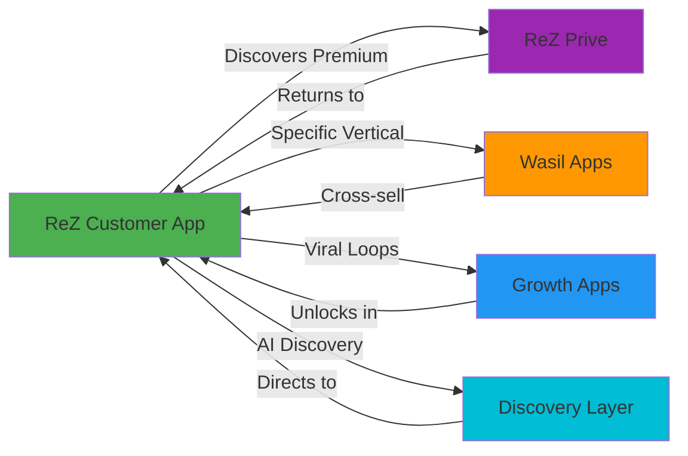
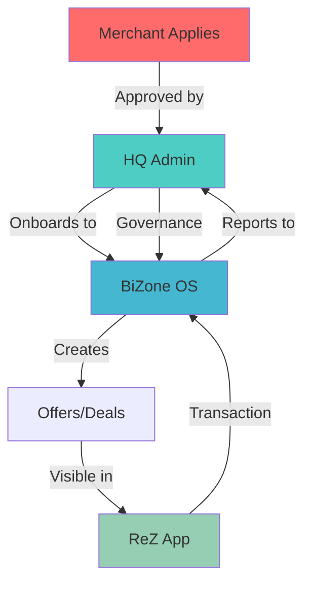
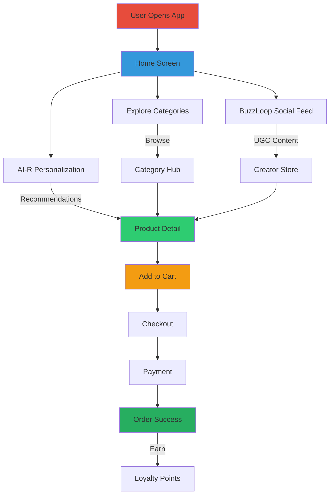

# RTMN Screen Metadata & UX Guide

**Total Screens:** 1,103
**Last Updated:** 2026-01-03

This document provides comprehensive metadata for all screens including:
- Screen type classification
- User roles and permissions
- Key features and interactions
- Navigation patterns
- UX best practices

---

## Screen Type Classification

### 1. Entry Points (Landing Screens)
**Purpose:** First screen users see when entering an app section

**Examples:**
- `Home.jsx` - Main app entry
- `MerchantDashboard.jsx` - Merchant OS entry
- `RezPrive.jsx` - Premium tier entry
- `HQCommandCenter.jsx` - Admin entry

**UX Characteristics:**
- Hero section with primary CTAs
- Quick access navigation cards
- Status overview widgets
- Recent activity feed
- Search bar prominence

---

### 2. Hub Screens
**Purpose:** Central navigation point for a feature area

**Examples:**
- `LoyaltyHub.jsx` - Loyalty program center
- `GamificationHub.jsx` - Gamification features
- `CategoryHub.jsx` - Category browsing
- `SocialHub.jsx` - Social features

**UX Characteristics:**
- Tab navigation or segmented control
- Feature cards or tiles
- Progress indicators
- Quick stats summary
- Deep links to sub-features

---

### 3. List/Browse Screens
**Purpose:** Display collections of items

**Examples:**
- `ProductListing.jsx`
- `OrderHistory.jsx`
- `MerchantCustomers.jsx`
- `DealStore.jsx`

**UX Characteristics:**
- Filterable and sortable lists
- Search functionality
- Infinite scroll or pagination
- Grid or list view toggle
- Quick action buttons (favorite, share, etc.)

---

### 4. Detail Screens
**Purpose:** Show complete information about a single item

**Examples:**
- `ProductDetail.jsx`
- `OrderDetail.jsx`
- `MerchantAnalyticsDetail.jsx`
- `EventDetail.jsx`

**UX Characteristics:**
- Image gallery or carousel
- Detailed information sections
- Primary and secondary CTAs
- Related items section
- Reviews/ratings
- Share functionality

---

### 5. Form/Input Screens
**Purpose:** Collect user input

**Examples:**
- `AddressManagement.jsx`
- `MerchantBusinessDetails.jsx`
- `KYCSubmission.jsx`
- `CheckoutReview.jsx`

**UX Characteristics:**
- Progressive disclosure
- Inline validation
- Clear error messaging
- Save draft functionality
- Step indicators (if multi-step)
- Required field indicators

---

### 6. Modal/Overlay Screens
**Purpose:** Focused interaction without leaving context

**Examples:**
- `QRScanner.jsx` - Camera modal
- `PaymentGateway.jsx` - Payment flow
- Filter/Sort modals
- Confirmation dialogs

**UX Characteristics:**
- Centered or slide-up animation
- Dismiss on background tap
- Clear close button
- Single-purpose focus
- Minimal navigation

---

### 7. Tab Views
**Purpose:** Related content with quick switching

**Examples:**
- Profile sections (Posts, Saved, Activity)
- Merchant Analytics (Daily, Weekly, Monthly)
- Order status tabs (Active, Completed, Cancelled)

**UX Characteristics:**
- Persistent tab bar
- Smooth transitions
- Badge counts on tabs
- Swipeable content
- Active tab indicator

---

### 8. Wizard/Multi-Step Flows
**Purpose:** Guide users through complex processes

**Examples:**
- `Onboarding.jsx` - App onboarding
- `MerchantSetup.jsx` - Merchant registration
- `Checkout.jsx` - Purchase flow
- `KYCSubmission.jsx` - Verification process

**UX Characteristics:**
- Clear step progression
- Back/forward navigation
- Progress bar
- Review before submit
- Ability to save and resume

---

## User Role Classification

### Customer Roles

#### 1. Guest User
**Access Level:** Limited
**Key Screens:**
- Home, Explore, Category browsing
- Product details (read-only)
- Login/Signup prompts

**Restrictions:**
- Cannot add to cart
- Cannot access wallet
- Cannot view loyalty points

---

#### 2. Regular Customer
**Access Level:** Standard
**Key Screens:**
- Full shopping experience
- Cart and checkout
- Basic wallet
- Standard loyalty program
- Order history

**Features:**
- Make purchases
- Earn ReZ Coins
- Participate in basic offers
- Social features (if opted in)

---

#### 3. ReZ Prive Member
**Access Level:** Premium
**Key Screens:**
- All regular screens +
- Exclusive prive screens
- Premium content
- Early access features
- VIP support

**Features:**
- Enhanced cashback
- Exclusive offers
- Priority support
- Premium partner benefits
- Concierge services

---

### Merchant Roles

#### 1. Merchant Owner
**Access Level:** Full
**Key Screens:**
- Complete BiZone dashboard
- All merchant management screens
- Financial controls
- Multi-store management
- Staff management

**Permissions:**
- Full system access
- Financial operations
- Settings configuration
- User management

---

#### 2. Merchant Manager
**Access Level:** Management
**Key Screens:**
- Operations dashboard
- Inventory management
- Staff scheduling
- Customer management
- Reports (limited)

**Permissions:**
- Daily operations
- Staff management
- Inventory control
- Customer service

---

#### 3. Merchant Staff/Cashier
**Access Level:** Limited
**Key Screens:**
- POS interface
- Billing screens
- Customer lookup
- Basic inventory

**Permissions:**
- Process transactions
- View inventory
- Basic customer service
- Cannot access financials

---

### Admin Roles

#### 1. HQ Super Admin
**Access Level:** Full System
**Key Screens:**
- Complete HQ command center
- All admin screens
- System configuration
- User governance
- Merchant governance

**Permissions:**
- Full platform control
- Create/modify any entity
- Access all data
- System configuration

---

#### 2. HQ Operations Admin
**Access Level:** Operations
**Key Screens:**
- Operations dashboard
- Merchant approval
- Customer support
- Transaction monitoring

**Permissions:**
- Merchant onboarding
- Support escalations
- Operational reports
- Limited system config

---

## Screen Interaction Patterns

### Navigation Patterns

#### 1. Bottom Tab Navigation (Mobile)
```
[Home] [Explore] [Wallet] [Earn] [Profile]
```
**Used in:** ReZ Customer App
**Behavior:** Persistent across app, each tab has own stack

---

#### 2. Drawer Navigation (Merchant)
```
[☰ Menu] → Sidebar with sections
```
**Used in:** BiZone Merchant OS
**Behavior:** Collapsible side menu with hierarchical navigation

---

#### 3. Top Tab Navigation
```
[Tab1] [Tab2] [Tab3]
```
**Used in:** Analytics screens, Profile sections
**Behavior:** Swipeable tabs for related content

---

#### 4. Stack Navigation
```
Screen A → Screen B → Screen C
[←] Back button
```
**Used in:** Universal
**Behavior:** Push/pop navigation with back gesture

---

### Common UI Components Across Screens

#### 1. Header Patterns

**Standard Header:**
```
[← Back]    [Screen Title]    [Action/Menu]
```

**Search Header:**
```
[← Back]    [🔍 Search input...]    [Filter]
```

**Transparent Header (Detail screens):**
```
[← Back]                           [♡ Share]
(Overlays hero image)
```

---

#### 2. Call-to-Action Buttons

**Primary CTA:**
- Full width button at bottom
- Sticky/fixed position
- Prominent color (brand color)
- Examples: "Add to Cart", "Checkout", "Pay Now"

**Secondary CTA:**
- Outline or ghost button
- Positioned near primary
- Examples: "Save for Later", "More Info"

---

#### 3. Cards & Lists

**Product Card:**
- Image (16:9 or 1:1)
- Title
- Price (original + discounted)
- Coins earned badge
- Quick action (heart, cart+)

**Transaction Card:**
- Icon (status indicator)
- Title & description
- Amount (colored by type)
- Date/time
- Status badge

**Merchant Card (Dashboard):**
- KPI value (large)
- Label
- Trend indicator (↑↓%)
- Sparkline chart

---

#### 4. Empty States

**Pattern:**
```
[Illustration/Icon]
Bold message
Supportive text explaining why empty
[Primary CTA button]
```

**Examples:**
- Empty cart: "Your cart is empty" → "Start Shopping"
- No orders: "No orders yet" → "Explore Deals"
- No transactions: "No transactions" → "Make your first purchase"

---

## Cross-App Navigation Maps

### Map 1: Customer Journey Across Apps



---

### Map 2: Merchant Journey



---

### Map 3: Discovery Flow



---

## Screen Metadata Reference

### ReZ Customer App - Key Screens

| Screen | Type | User Role | Features | Navigates To |
|--------|------|-----------|----------|--------------|
| Home | Entry Point | All | Hero, Categories, Deals, Reels | Category hubs, Products, Deals |
| Explore | Hub | All | AI recommendations, Search, Trending | Products, Stores, Creators |
| Cart | Standard | Customer | Line items, Promo codes, Checkout | Checkout, Product details |
| Checkout | Wizard | Customer | Address, Payment, Review | Payment gateway, Success |
| Profile | Hub | Customer | Settings, Orders, Wallet, Loyalty | Sub-screens |
| LoyaltyHub | Hub | Customer | Points, Tiers, History, Rewards | Reward redemption |
| Wallet | Standard | Customer | Balance, Topup, History | Payment methods, Topup |
| SocialHub | Hub | Customer | Feed, Following, Trending | Creator profiles, Posts |

---

### BiZone Merchant OS - Key Screens

| Screen | Type | User Role | Features | Navigates To |
|--------|------|-----------|----------|--------------|
| MerchantDashboard | Entry Point | All Merchant | KPIs, Quick actions, Alerts | All sections |
| MerchantPOS | Standard | Staff/Cashier | Billing, Scanner, Payment | Checkout, Receipt |
| MerchantInventory | List | Manager+ | Products, Stock levels, Alerts | Product edit, Restock |
| MerchantCustomers | List | Manager+ | Customer list, Segments, CRM | Customer detail |
| MerchantAnalytics | Hub | Owner/Manager | Sales, Revenue, Trends | Detailed reports |
| MerchantOffers | List | Owner/Manager | Active offers, Create new | Offer builder |
| MerchantSettings | Standard | Owner | Business info, Staff, Integrations | Sub-settings |

---

### HQ Admin - Key Screens

| Screen | Type | User Role | Features | Navigates To |
|--------|------|-----------|----------|--------------|
| HQCommandCenter | Entry Point | Admin | System overview, Alerts, Actions | All admin functions |
| MerchantGovernance | List | Admin | Merchant approvals, Monitoring | Merchant details |
| UserAccessGovernance | List | Super Admin | User permissions, Roles | User details |
| ZoneManagement | Standard | Admin | Geographic zones, Coverage | Zone details |

---

## UX Best Practices by Screen Type

### Entry Points / Landing Screens
✅ **Do:**
- Show value proposition immediately
- Provide clear navigation paths
- Display personalized content
- Include search prominently
- Show social proof

❌ **Don't:**
- Overload with information
- Hide primary navigation
- Auto-play videos (mobile)
- Force login before browsing

---

### List/Browse Screens
✅ **Do:**
- Implement virtual scrolling for performance
- Show loading skeletons
- Provide filters and sorting
- Add quick actions on items
- Support pull-to-refresh

❌ **Don't:**
- Load all items at once
- Hide filter options
- Use slow animations
- Neglect empty states

---

### Detail Screens
✅ **Do:**
- Lead with high-quality imagery
- Progressive disclosure of information
- Sticky CTA buttons
- Show social proof (reviews)
- Enable sharing

❌ **Don't:**
- Require scrolling to see CTA
- Auto-play sound
- Hide important details in tabs
- Neglect related items

---

### Form Screens
✅ **Do:**
- Inline validation
- Clear error messages
- Logical field ordering
- Smart defaults
- Save progress

❌ **Don't:**
- Validate on blur for all fields
- Use placeholder as label
- Make everything required
- Lose data on back navigation

---

## Accessibility Considerations

### All Screens Must Have:
1. ✅ Proper heading hierarchy
2. ✅ Touch targets ≥ 44x44pt
3. ✅ Sufficient color contrast (WCAG AA)
4. ✅ Alternative text for images
5. ✅ Keyboard navigation support
6. ✅ Screen reader compatibility
7. ✅ Focus indicators
8. ✅ Error identification

---

## Performance Guidelines

### Screen Load Times Target:
- **Landing screens:** < 2 seconds
- **List screens:** < 1.5 seconds (first render)
- **Detail screens:** < 2 seconds
- **Form screens:** < 1 second

### Optimization Techniques:
1. Code splitting by route
2. Lazy load images
3. Virtual scrolling for lists
4. Prefetch critical resources
5. Cache API responses
6. Optimize bundle size

---

## Conclusion

This metadata guide should be referenced when:
- Designing new screens
- Refactoring existing screens
- Conducting UX reviews
- Planning user flows
- Implementing navigation
- Setting up permissions

**Next Steps:**
1. Apply this taxonomy to all 1,103 screens
2. Conduct screen-by-screen UX audits
3. Standardize component patterns
4. Create design system library
5. Implement automated UX testing

---

**Document Status:** Living Document - Update as patterns evolve
